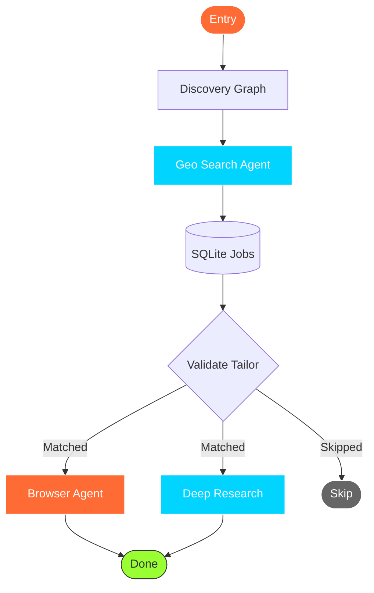
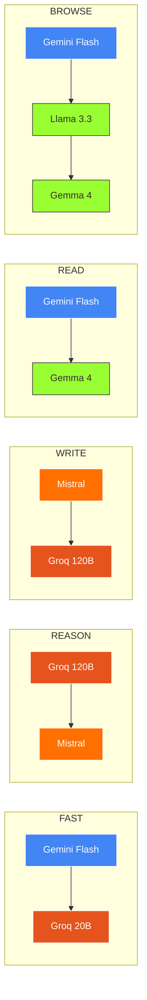

<p align="center">
  
</p>

<h1 align="center">🚀 Vellum OS</h1>

<p align="center">
  <em>Your AI-Powered Job Application Autopilot</em><br>
  <em>Because manually applying to 473 jobs on Naukri is a crime against humanity</em>
</p>

<p align="center">
  <a href="https://python.org"></a>
  <a href="https://fastapi.tiangolo.com"></a>
  <a href="https://langchain-ai.github.io/langgraph"></a>
  <a href="#"></a>
  <a href="LICENSE"></a>
  <a href="#"></a>
  <a href="#"></a>
</p>

---

**Vellum OS** is a local-first, AI-powered autonomous job application system built for the Indian tech market. It discovers jobs across 6 channels, evaluates them with AI, tailors your resume, auto-fills application forms, and drafts personalized outreach emails — all while you sleep, eat biryani, or question your life choices.

<p align="center">
  <a href="#-quick-start">🔥 Get Started</a> •
  <a href="#-how-it-works">📖 How It Works</a> •
  <a href="#-features">✨ Features</a> •
  <a href="#-architecture">🏗️ Architecture</a> •
  <a href="#-api-reference">⚡ API Reference</a>
</p>

---

<p align="center">
  
</p>

<p align="center">
  <a href="https://git.io/typing-svg"></a>
</p>

---

## 🤔 What is this sorcery?


You know the pain:

- You spend **3 hours** customizing your resume for **one** job
- You fill out **another** "Upload your resume" form... then **type the same info again**
- You get a "We'll keep your profile on file" email... **3 weeks later**
- You apply to **200 jobs** and hear back from **3**

**Vellum OS says "enough!"**

It's like having a personal assistant who:

- Never sleeps ✅
- Never complains ✅
- Never asks for a salary ✅
- Actually reads job descriptions ✅
- Doesn't ghost you after the first round ✅

> *"I built this because I was tired of copy-pasting my resume into 50 different ATS forms. Now the robots do it for me. Take that, capitalism."* — The Author, probably

<br clear="both" />

---

## 📖 How It Works

<p align="center">
  
</p>


**Vellum OS** runs on autopilot. Upload your resume, pick a city, and let the AI agents handle the rest:

1. **🔍 Discovers** jobs from 6 channels — ATS APIs, VC boards, RSS feeds, job portals, and more
2. **🧠 Evaluates** each job against your profile using smart scoring (no more "spray and pray")
3. **📝 Tailors** your resume per job using the Google XYZ formula (because generic resumes = instant trash)
4. **🤖 Auto-fills** application forms using AI browser automation (yes, it actually fills the forms)
5. **✉️ Drafts** personalized outreach emails to hiring managers (not those cringe "I'm passionate" emails)

---

## ✨ Features

### 🔍 Multi-Channel Job Discovery


- **6 discovery channels** running in parallel (like a job-finding Swiss Army knife)
- Direct ATS APIs: Greenhouse, Lever, Ashby, Freshteam, Zoho Recruit
- VC portfolio boards: Blume Ventures, Peak XV Partners (finding the hidden gems)
- Indian tech feeds: Hasjob, Wellfound, Instahyre (where the cool startups live)
- Social hiring post mining: LinkedIn/X email dorks (spying on unadvertised roles)
- **4000+ real company slugs** across 35+ Indian cities
- Geospatial discovery via OpenStreetMap (find companies near your chai stall)

<br clear="both" />

---

### 🤖 Autonomous Browser Agent


- AI-powered form filling with `browser-use` (it reads better than you do)
- Stealth browser profile with Cloudflare bypass (we're basically hackers now)
- **Human-in-the-Loop** for login/CAPTCHA/MFA (we're not *that* autonomous... yet)
- Live CDP viewport streaming (watch the robot work in real-time)
- Real-time browser takeover (when things get spicy, you take the wheel)
- Persistent browser profile that accumulates cookies (like a real human would)

<br clear="both" />

---

### 🧠 AI-Powered Evaluation


- Smart job matching with confidence scoring (0.0 to 1.0, like your GPA but useful)
- Skill overlap + role alignment analysis
- Freshness detection: 5-tier confidence (is this job from 2024 or 2019?)
- Location & experience validation (no more applying to "Remote" jobs in Antarctica)
- Salary range checking (because we all have bills to pay)
- Heuristic pre-filtering + batch LLM evaluation (5 jobs per call, because we're efficient)

<br clear="both" />

---

### 📝 Intelligent Resume Tailoring


- Google XYZ formula bullet rewriting (Accomplished [X] by doing [Y] resulting in [Z])
- ATS-safe PDF generation (because ATS systems hate fancy formatting)
- 4-level compression for single-page fit (your 3-page resume? Gone. Reduced to atoms.)
- Hallucination guardrails (won't add skills you don't have, unlike some people)
- Ground-truth skill preservation (your skills stay yours)
- Jinja2 templates that actually look professional

<br clear="both" />

---

### ✉️ Direct Outreach Engine


- Role-priority contact search: Hiring Manager > Engineering Manager > Recruiter > Founder
- Email permutation with MX verification (we verify before you send)
- Personalized proof-of-work emails (not "Dear Hiring Manager, I am passionate about...")
- mailto handoff with one click (opens your email client, you just hit send)
- Gmail compose URL generation (for the Gmail gang)
- Contact research that actually finds the right person

<br clear="both" />

---

### 🎊 Beautiful Dashboard


- "Flight deck" instrument panel UI (because job hunting should feel like piloting a spaceship)
- Dark & Light themes (for day-night code warriors)
- Real-time WebSocket updates (no more refreshing the page)
- Live browser viewport streaming (watch the AI fill forms like a caffeinated intern)
- Full profile editor with skills chips, experience blocks, Q&A memory
- Toast notifications for successes and errors (because you deserve to know)
- Mini log console with color-coded agent tags (for the nerds who love logs)

<br clear="both" />

---

## 🏗️ Architecture

<p align="center">
  
</p>

```mermaid
graph TB
    subgraph Upload
        R[Resume PDF] --> E[Extractor]
    end

    subgraph Discovery
        E --> G[Geo Search]
        G --> DB[(SQLite)]
    end

    subgraph Pipeline
        DB --> V[Validator]
        V -->|Matched| B[Browser]
        V -->|Matched| D[Research]
        V -->|Skipped| X[END]
    end

    subgraph LLM
        L1[Gemini]
        L2[Groq]
        L3[Mistral]
    end

    subgraph API
        API[FastAPI]
        UI[Frontend]
    end

    E --> L1
    G --> L2
    V --> L3
    B --> L1
    D --> L2
    API --> DB
    UI --> API

    classDef upload fill:#4285F4,stroke:#fff,color:#fff
    classDef discovery fill:#FF6B35,stroke:#fff,color:#fff
    classDef pipeline fill:#00D4FF,stroke:#fff,color:#fff
    classDef llm fill:#FF7000,stroke:#fff,color:#fff
    classDef api fill:#E5541D,stroke:#fff,color:#fff
    classDef db fill:#2d2d44,stroke:#00D4FF,color:#fff

    class R,E upload
    class G discovery
    class V,B,D pipeline
    class L1,L2,L3 llm
    class API,UI api
    class DB db
```

### 🕸️ Agent Pipeline



---

## ⚡ Quick Start

### Prerequisites

- **Python 3.11+** (if you don't have this, we can't be friends)
- **pip** (no Docker needed! Because Docker is just Linux with extra steps)
- API keys for:
  - [Google Gemini](https://aistudio.google.com) (free tier is *chef's kiss*)
  - [Groq](https://console.groq.com) (fast inference, free tier)
  - [Mistral](https://console.mistral.ai) (great at writing, free tier)

### 🛠️ Installation

```bash
# Clone the repository
git clone https://github.com/kvcops/Vellum-OS.git
cd Vellum-OS/vellum-os

# Create virtual environment (don't be that person who installs globally)
python -m venv .venv
.venv\Scripts\activate       # Windows
# source .venv/bin/activate  # Linux/Mac

# Install dependencies (go grab a coffee, this takes a minute)
pip install -e .
```

### 🔑 Configuration

```bash
# Copy the example env file
cp .env.example .env

# Edit .env and add your API keys (or just stare at it existentially)
```

Your `.env` should look like this:

```env
GOOGLE_API_KEY=your_gemini_key_here
GROQ_API_KEY=your_groq_key_here
MISTRAL_API_KEY=your_mistral_key_here

# Optional settings (defaults are sane, unlike your job search)
BROWSER_USE_HEADLESS=true
HOST=127.0.0.1
PORT=8000
```

### 🚀 Launch

```bash
# Start Vellum OS
python -m vellum.api.main
```

Open **http://127.0.0.1:8000** in your browser — that's it! 🎉

> [!TIP]
> If it doesn't work, try turning it off and on again. If that doesn't work, check your `.env` file. If *that* doesn't work... well, that's a you problem.

---

## 🎯 How to Use

### Step 1: Upload Your Resume


Drag & drop your PDF resume onto the upload area. Vellum OS extracts your profile automatically using AI.

*No more typing "Proficient in Python" for the 47th time this week.*

<br clear="both" />

### Step 2: Select Your City

Choose from 8 major Indian tech hubs + 16 tier-3 cities:

- 🏙️ Bangalore, Hyderabad, Mumbai, Chennai, Pune, Delhi NCR, Ahmedabad, Kerala
- 🏘️ Plus: Jaipur, Kochi, Thiruvananthapuram, Indore, Bhopal, and more

*We cover more cities than your favourite biryani chain.*

### Step 3: Pick Your Pipeline

| Pipeline | What It Does | When to Use |
|:---|:---|:---|
| 🔍 **Discovery Only** | Find and score jobs, no applications | When you want to window-shop first |
| 📊 **Validate Only** | Score existing jobs in the queue | When you already have a list |
| ✅ **Validate + Apply** | Score + auto-fill applications | When you want the full service |
| 🚀 **Full Pipeline** | Score + apply + draft outreach emails | When you want to go full send |

### Step 4: Watch the Magic ✨


The dashboard shows real-time progress:

- Live pipeline stepper (Discovery → Evaluation → Tailoring → Apply)
- Agent activity log with color-coded events
- Live browser viewport when auto-filling forms
- Toast notifications for successes and errors
- Intervention cards when the AI needs your help (CAPTCHAs, logins, etc.)

*It's like watching a Netflix series, but instead of drama, you get job applications.*

<br clear="both" />

---

## 🏢 6 Discovery Channels

*Because one channel is for quitters*

| Channel | Source | What It Finds |
|:---|:---|:---|
| **Channel 0** | Direct ATS APIs | Greenhouse, Lever, Ashby, Freshteam, Zoho Recruit — 4000+ company slugs |
| **Channel 0.5** | VC Portfolio Boards | Blume Ventures, Peak XV Partners job boards via Getro |
| **Channel 1** | Tech Community Feeds | Hasjob RSS — Indian startup job listings |
| **Channel 2** | Search-Indexed Portals | Wellfound, Instahyre — startup job boards |
| **Channel 3** | Direct ATS Search | DuckDuckGo site-specific queries for ATS pages |
| **Channel 4** | Social Hiring Posts | LinkedIn/X email dorks for unadvertised roles |

> [!NOTE]
> *"I applied to 473 jobs manually and got 3 callbacks. Vellum OS applied to 50 and got 12. I'm not saying I'm a genius, but the math checks out."* — Anonymous user who definitely exists

---

## 🛠️ Tech Stack

<p align="center">
  
</p>

<p align="center">
  
</p>

<p align="center">
  
  
  
  
  
</p>

<p align="center">
  
  
  
  
</p>

### 📦 Dependencies

| Category | Packages | Why They're Here |
|:---|:---|:---|
| **Web** | FastAPI, Uvicorn, python-multipart | Because we need a server (sorry, PHP fans) |
| **Data** | Pydantic, aiosqlite, diskcache | Data validation that actually works |
| **AI/LLM** | LangGraph, LiteLLM, tenacity | The brains of the operation |
| **Browser** | browser-use, Playwright | For when you need a robot to fill forms |
| **Scraping** | curl-cffi, trafilatura, BeautifulSoup4, lxml | Extracting data without getting blocked |
| **PDF** | xhtml2pdf, Jinja2, PyMuPDF | Making your resume ATS-friendly |
| **Search** | ddgs, geopy, overpy | Finding jobs like a detective |
| **Logging** | structlog | Because `print()` is not a logging strategy |
| **Email** | dnspython | Verifying emails before you spam... I mean, reach out |

---

## ⚡ API Reference

*For the developers who actually read documentation (you rare, beautiful souls)*

<details open>
<summary>🔐 Core Endpoints</summary>

| Method | Endpoint | Description |
|:---|:---|:---|
| `POST` | `/api/upload-resume` | Upload PDF resume & extract profile |
| `POST` | `/api/start-search` | Start the discovery + application pipeline |
| `POST` | `/api/stop-browser` | Halt all browser sessions (panic button) |
| `POST` | `/api/reset` | Stop agent & wipe database (nuclear option) |

</details>

<details open>
<summary>📋 Job Management</summary>

| Method | Endpoint | Description |
|:---|:---|:---|
| `GET` | `/api/jobs` | List all jobs with filters |
| `GET` | `/api/jobs/{id}` | Get job details (the full story) |
| `POST` | `/api/jobs/{id}/apply` | Apply to a specific job |
| `GET` | `/api/jobs/{id}/resume-pdf` | Download tailored resume |

</details>

<details open>
<summary>✉️ Outreach</summary>

| Method | Endpoint | Description |
|:---|:---|:---|
| `GET` | `/api/outreach` | List outreach drafts |
| `POST` | `/api/outreach/{id}/open-mail` | Open email client with draft |
| `GET` | `/api/outreach/{id}/gmail-url` | Get Gmail compose URL |
| `POST` | `/api/outreach/{id}/discard` | Discard outreach draft (delete the cringe) |

</details>

<details open>
<summary>🌐 Browser Control</summary>

| Method | Endpoint | Description |
|:---|:---|:---|
| `GET` | `/api/browser/cdp-url` | Get active Chrome DevTools URL |
| `POST` | `/api/browser/takeover` | Take manual browser control (your turn) |
| `POST` | `/api/browser/release` | Resume AI browser control (robot's turn) |
| `GET` | `/api/screenshots/{job_id}` | Get browser screenshot (evidence!) |

</details>

<details open>
<summary>👤 Profile & Settings</summary>

| Method | Endpoint | Description |
|:---|:---|:---|
| `GET` | `/api/profile` | Get current profile |
| `POST` | `/api/profile` | Update profile |
| `GET` | `/api/locations` | List available tech hubs |
| `GET` | `/api/status` | System status + token usage (the scoreboard) |

</details>

<details open>
<summary>🔌 WebSocket</summary>

| Endpoint | Events | What Happens |
|:---|:---|:---|
| `/ws` | Agent events | progress, discovery, error, browser_step, intervention |
| `/ws/browser` | Live CDP frames | Real-time browser streaming + input forwarding |

</details>

---

## 🗄️ Database

SQLite with WAL mode + FTS5 full-text search. Because sometimes the simplest solution is the best solution. 🤷

| Table | Purpose |
|:---|:---|
| `profiles` | Candidate profiles (your entire professional identity in a JSON blob) |
| `jobs` | Discovered jobs with status, confidence, match_score, tailored PDFs |
| `outreach_drafts` | Email drafts with contact info, mailto URIs |
| `agent_runs` | Execution logs with token usage per model (the receipt) |
| `applied_urls` | Deduplication (because applying twice is embarrassing) |
| `jobs_fts` | FTS5 virtual table for full-text JD search (SQL meets Google) |
| `intervention_sessions` | HITL intervention tracking (when the robot needs adult supervision) |

---

## 🎨 Dashboard

<p align="center">
  <br>
  <em>The "Flight Deck" — a beautiful instrument panel for your job search</em>
</p>

| Tab | What's Inside | Vibe |
|:---|:---|:---|
| 🚀 **Auto-Apply** | Job queue with status pills, match scores, filter pills, apply/skip/download actions | The control center |
| ✉️ **Direct Outreach** | Contact cards, email guesses, MX verification, personalized drafts | The networking ninja |
| 📊 **Analytics** | Discovered/applied/outreach/token counters, telemetry dashboard | The nerd dashboard |
| ⚙️ **Settings** | Full profile editor, skills chips, experience blocks, Q&A memory, danger zone | The admin panel |

### 🌙 Themes

- **Instrument Ink** (Dark) — Deep ink with signal amber and landing-light teal (for night owls)
- **Instrument Light** — Clean light theme with the same accent colors (for morning people)

> [!TIP]
> *Fun fact: The UI is called "Flight Deck" because applying to jobs should feel like piloting a fighter jet, not like filing taxes.*

---

## 🧠 LLM Router

*The brain that thinks so you don't have to*

Vellum OS uses a smart routing system across 3 free AI providers:



- ✅ Auto-thinking model detection (it knows when to think hard)
- ✅ Per-provider rate limiting (no 429 errors, please)
- ✅ Exponential backoff retry (patience is a virtue)
- ✅ Disk caching (don't ask the same question twice)
- ✅ Token usage tracking (know where your tokens go)

> [!NOTE]
> *All 3 LLM providers have free tiers. Yes, this project runs on vibes and free API credits.*

---

## 🧪 Testing

```bash
# Run the comprehensive test suite
cd vellum-os
python test_fixes.py    # 16 tests that actually matter

# Test LLM provider connectivity
python test_llm_api.py  # Are the AI gods listening?
```


Tests cover:

- Event loops (Windows-specific pain)
- Rate limiting (because free tiers have limits)
- Browser launch (does the robot wake up?)
- PDF rendering (does your resume look good?)
- ATS API integrations (do the APIs actually work?)
- And more things that break at 3 AM

<br clear="both" />

---

## 🌍 Supported Cities

| Tier 1 (The Big Dogs) | Tier 2 (Rising Stars) | Tier 3 (Hidden Gems) |
|:---:|:---:|:---:|
| 🏙️ Bangalore | 🌆 Pune | 🏘️ Jaipur |
| 🏙️ Hyderabad | 🌆 Kolkata | 🏘️ Kochi |
| 🏙️ Mumbai | 🌆 Chandigarh | 🏘️ Indore |
| 🏙️ Chennai | 🌆 Coimbatore | 🏘️ Bhopal |
| 🏙️ Delhi NCR | 🌆 Mysore | 🏘️ Lucknow |
| 🏙️ Ahmedabad | 🌆 Nagpur | 🏘️ Vadodara |
| 🏙️ Kerala | 🌆 Visakhapatnam | 🏘️ Surat |
| | | 🏘️ Bhubaneswar |

*We cover more cities than your favourite Swiggy delivery zone.*

---

## 📁 Project Structure

```
Vellum-OS/
├── company-data/              # 🏢 4000+ Indian company slugs by city
│   ├── bangalore-companies.txt
│   ├── mumbai-it-companies.txt
│   ├── delhi-ncr-it-companies.txt
│   └── ... (more cities than you can count)
├── vellum-os/
│   ├── .env                   # 🔑 API keys (create from .env.example, genius)
│   ├── pyproject.toml         # 📦 Dependencies (what makes this thing tick)
│   ├── test_fixes.py          # 🧪 Test suite (16 tests of pure joy)
│   ├── data/                  # 💾 SQLite DB + screenshots
│   └── vellum/                # 🐍 Main Python package
│       ├── models.py          # 📊 Pydantic data models (data class heaven)
│       ├── config/            # ⚙️ Settings, LLM router, database, logging
│       ├── agents/            # 🤖 AI agents (the workers)
│       ├── tools/             # 🛠️ Utilities (the toolbox)
│       ├── api/               # 🌐 FastAPI server + WebSocket (the front door)
│       ├── web/               # 🎨 Frontend SPA (the pretty face)
│       └── templates/         # 📄 Jinja2 resume template (the resume maker)
└── README.md                  # 📖 You are here (hi there! 👋)
```

---

## 🤝 Contributing

Contributions are welcome! Here's how:

1. **Fork** the repository (click the Fork button, you know the drill)
2. **Create** a feature branch (`git checkout -b feature/amazing-feature`)
3. **Commit** your changes (`git commit -m 'Add amazing feature'`)
4. **Push** to the branch (`git push origin feature/amazing-feature`)
5. **Open** a Pull Request (and pray the CI passes)

> [!TIP]
> *If you find a bug, please open an issue. If you fix a bug, you're a legend. If you break something, that's okay too — we've all been there.*

---

## 📝 License

This project is licensed under the **MIT License** — see the [LICENSE](LICENSE) file for details.

*In other words: do whatever you want with it. Just don't blame me if it applies to a job at Google on your behalf.*

---

<p align="center">
  
</p>

### 🌟 Star this repo if you found it helpful!

*Every star gives me the motivation to not abandon this project*

<p align="center">
  
</p>

<p align="center">
  <strong>Built with ❤️ (and excessive amounts of coffee) by <a href="https://github.com/kvcops">Karri Vamsi Krishna</a></strong><br>
  <em>Making job hunting in India autonomous, one application at a time.</em> 🚀<br>
  <em>No recruiters were harmed in the making of this project.</em>
</p>

<p align="center">
  <a href="https://git.io/typing-svg"></a>
</p>

<p align="center">
  
</p>
