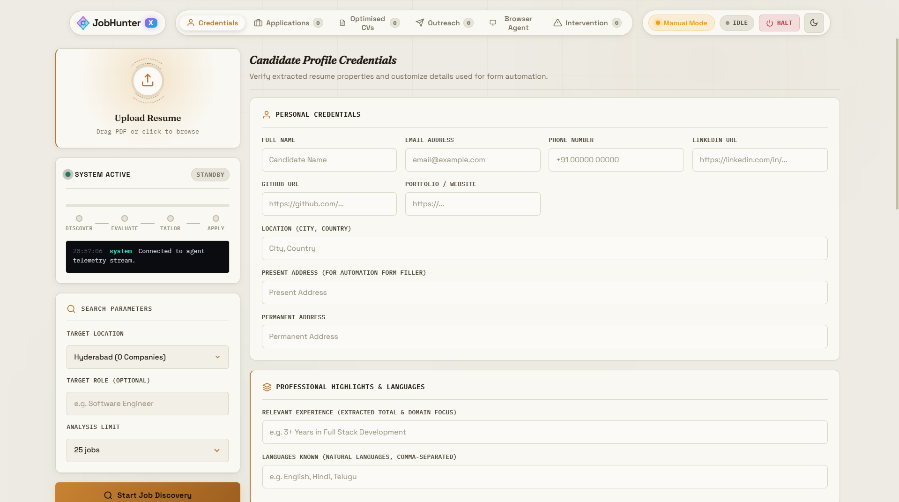
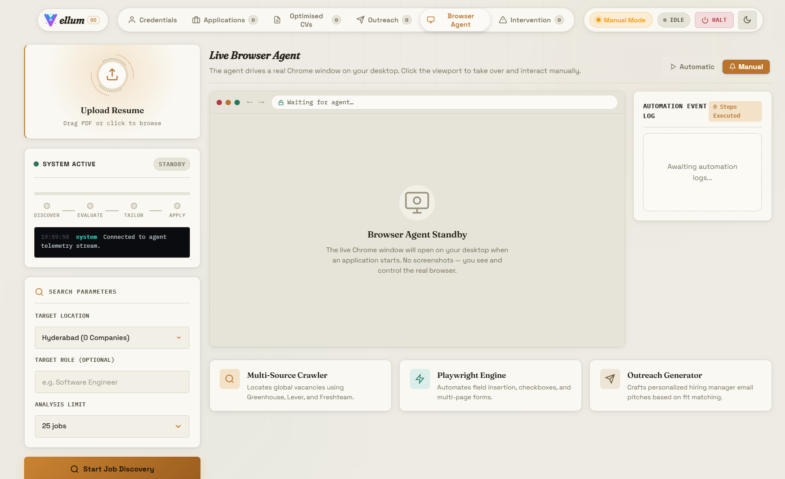
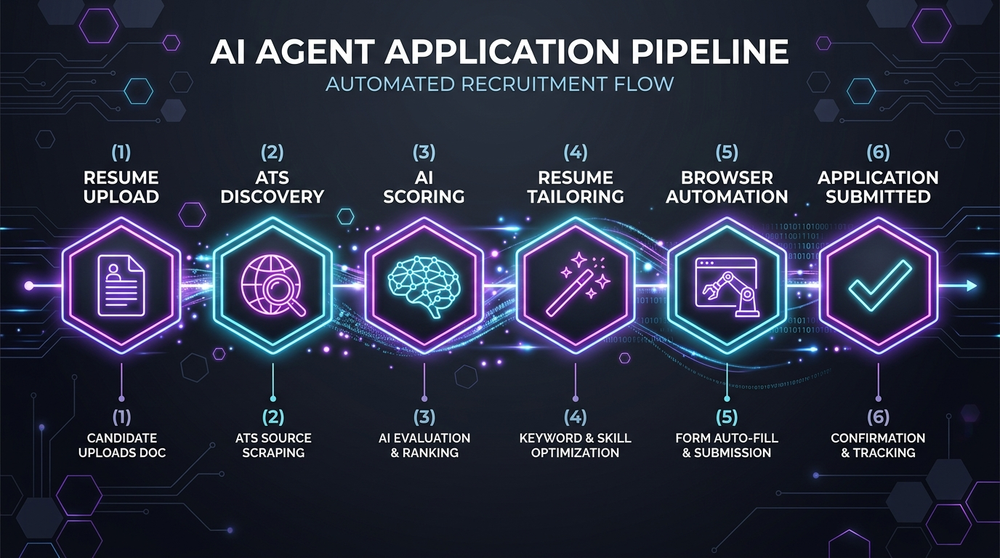
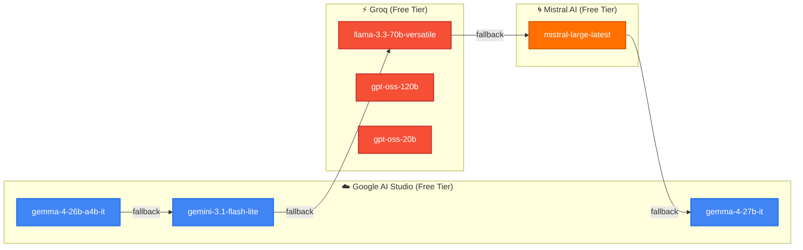
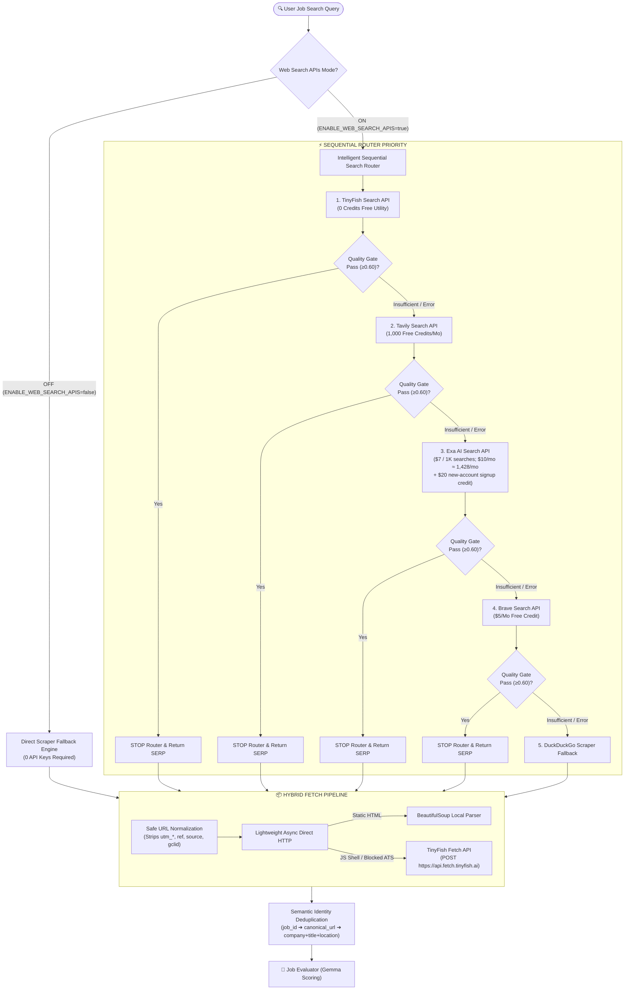
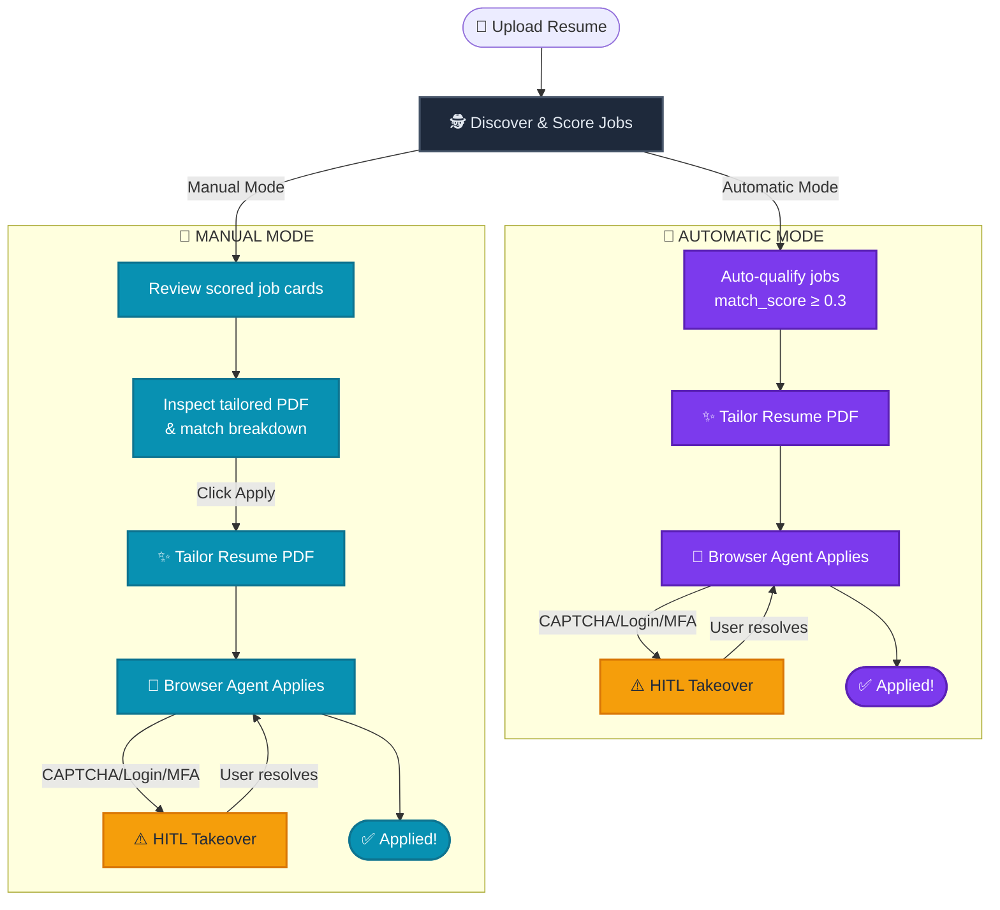
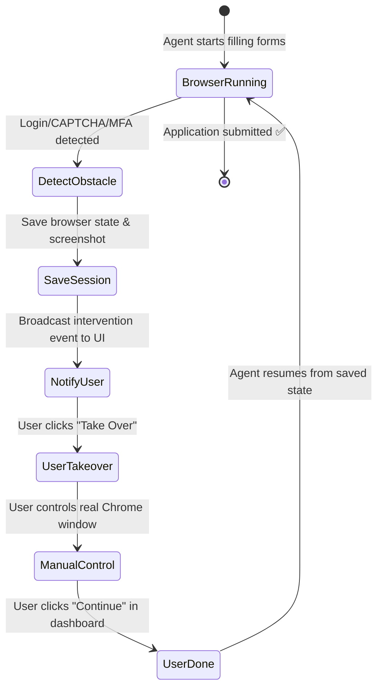
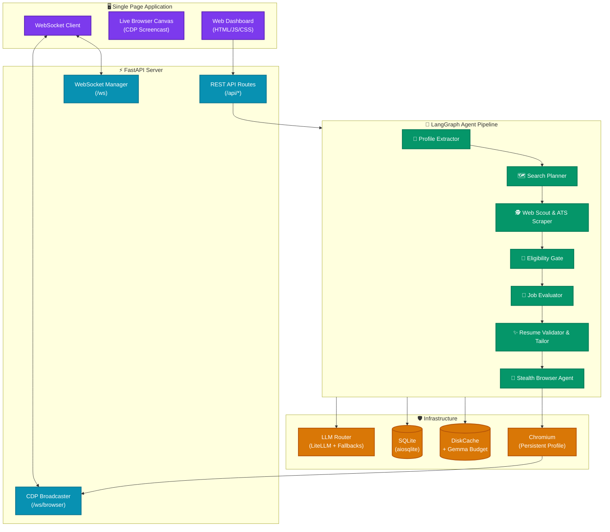

<div align="center">


<br/>


<p align="center">
  
</p>

<h3 align="center">🚀 Your Autonomous AI Career Intelligence Agent That Hunts, Matches, Tailors, and Applies — While You Sleep</h3>

<br/>

<p align="center">
  <a href="https://python.org"></a>
  <a href="https://fastapi.tiangolo.com"></a>
  <a href="https://langchain-ai.github.io/langgraph/"></a>
  <a href="https://playwright.dev"></a>
</p>

<p align="center">
  <a href="https://ai.google.dev/"></a>
  <a href="https://groq.com"></a>
  <a href="https://mistral.ai"></a>
  
</p>

<p align="center">
  
  
  
  
</p>

<p align="center">
  
  
  
</p>

<br/>


<br/>

<table>
<tr><td align="center">

*Upload your resume. Pick a city. Go grab coffee.*
**JobHunterX** discovers jobs, scores them against your skills, tailors a pixel-perfect PDF resume for each one, opens a stealth Chrome browser, fills every form field, and applies — streaming every frame live to your dashboard so you can take over the keyboard whenever a CAPTCHA or login wall shows up.

### 💜 *It's the job-hunting wingman you always wished you had.* 💜

</td></tr>
</table>

<br/>

<a href="#-quickstart"></a>
<a href="#-the-6-agent-pipeline"></a>
<a href="#-api-reference"></a>
<a href="#-testing"></a>

</div>

<br/>

<div align="center">

</div>

<br/>

<details open>
<summary><b>📚 Table of Contents</b></summary>
<br/>

- [🖥️ Dashboard Preview](#️-dashboard-preview)
- [✨ Browser Agent Preview](#-browser-agent-preview)
- [🧠 The 6-Agent Pipeline](#-the-6-agent-pipeline)
- [🤖 LLM Models & Provider Architecture](#-llm-models--provider-architecture)
- [🌐 Web Search Architecture](#-web-search-architecture--provider-modes)
- [🔄 Pipeline Modes](#-pipeline-modes-automatic-vs-manual)
- [🛡️ Human-in-the-Loop System](#️-human-in-the-loop-hitl-system)
- [🌐 ATS Platform Support](#-ats-platform-support)
- [📐 Full System Architecture](#-full-system-architecture)
- [📁 Project Structure](#-project-structure)
- [⚡ Quickstart](#-quickstart)
- [🔌 API Reference](#-api-reference)
- [🛡️ Stealth Browser Architecture](#️-stealth-browser-architecture)
- [📜 License](#-license)

</details>

<br/>

## 🖥️ Dashboard Preview

<div align="center">

<br/>
<sub><i>Dark-mode dashboard with scored job cards, live browser canvas streaming, and real-time agent activity feed</i></sub>
</div>

<br/>
<div align="center"></div>
<br/>

## ✨ Browser Agent Preview

<div align="center">

<br/>
<sub><i>Live browser canvas streaming, and real-time agent activity feed</i></sub>
</div>

<br/>
<div align="center"></div>
<br/>

## 🧠 The 6-Agent Pipeline

JobHunterX isn't one monolithic script. It's a **team of 6 specialized AI agents**, orchestrated by a **LangGraph state machine**, each doing what it does best — like a Formula 1 pit crew, but for your career.

<div align="center">

</div>

<br/>

### Agent Breakdown

<table>
<thead>
<tr>
<th align="center">#</th>
<th align="left">Agent</th>
<th align="left">Codename</th>
<th align="left">What It Does</th>
<th align="left">Powered By</th>
</tr>
</thead>
<tbody>
<tr>
<td align="center">🧬</td>
<td><b>Profile Extractor</b></td>
<td><code>extractor.py</code></td>
<td>Parses your resume PDF (via PyMuPDF), extracts skills, experience, education, projects, LinkedIn/GitHub URLs, and builds a structured <code>CandidateProfile</code> — the ground truth that powers everything downstream.</td>
<td><b>Gemma 4 26B</b> → Gemini 3.1 Flash Lite</td>
</tr>
<tr>
<td align="center">🗺️</td>
<td><b>Search Planner</b></td>
<td><code>search_planner.py</code></td>
<td>Reads your profile and generates a smart <code>search_plan</code>: seniority ceiling, target roles, reject terms, and location preferences. In multi-agent mode, crafts 15–20 precision DuckDuckGo queries targeting startups and product companies while filtering out mass-hiring IT service spam.</td>
<td><b>Gemma 4 26B</b> (direct Google GenAI)</td>
</tr>
<tr>
<td align="center">🕵️</td>
<td><b>Web Scout & ATS Scraper</b></td>
<td><code>job_search_agents.py</code> + <code>ats_client.py</code></td>
<td>Executes search queries, scrapes ATS boards (Greenhouse, Ashby, Lever, Recruitee, SmartRecruiters, BambooHR), blacklists aggregators (LinkedIn, Indeed, Naukri, Glassdoor), deduplicates via <code>seen_job_urls</code>, runs the zero-token Eligibility Gate, and streams <code>job_found</code> events live.</td>
<td><b>Zero-token</b> (pure async Python + HTTP)</td>
</tr>
<tr>
<td align="center">🎯</td>
<td><b>Job Evaluator</b></td>
<td><code>job_scorer.py</code></td>
<td>Two-stage scoring: (1) <b>Deterministic keyword pre-filter</b> — skill overlap 55%, role match 20%, location 10%, freshness 5%. (2) <b>Gemma batch scoring</b> — groups top jobs into batches of 10, scores multi-dimensionally (skill fit, seniority, location, experience), and generates match reasons.</td>
<td><b>Gemma 4 26B</b> (budget-aware, 15K tokens/day)</td>
</tr>
<tr>
<td align="center">✨</td>
<td><b>Resume Validator & Tailor</b></td>
<td><code>validator_tailor.py</code></td>
<td>Validates freshness (URL/header checks), evaluates match score, then generates a tailored Executive Summary and transforms experience bullets using Google's XYZ action-led formula. Includes <b>anti-hallucination sanitizers</b> — no fabricated skills or made-up metrics. Renders a single-page ATS-optimized PDF via Jinja2 + xhtml2pdf with 4 iterative shrink profiles.</td>
<td><b>Gemma 4 26B</b> → Gemini 3.1 Flash Lite</td>
</tr>
<tr>
<td align="center">🥷</td>
<td><b>Stealth Browser Agent</b></td>
<td><code>browser_agent.py</code></td>
<td>The closer. Opens a persistent Chrome profile with anti-detection headers, fills personal details, education, work history, Q&A memory (salary, notice period, work auth), uploads the tailored PDF, and submits. Streams every browser frame live via CDP WebSocket. When it hits a login wall, CAPTCHA, or MFA — it pauses and hands you the keyboard.</td>
<td><b>Gemini 3.1 Flash Lite</b> → Llama 3.3 70B (Groq) → Mistral Large → Gemma 4 27B</td>
</tr>
</tbody>
</table>

<br/>

> [!TIP]
> **The Eligibility Gate** (`eligibility.py`) runs between Agents 3 and 4 as a zero-token strict filter. It rejects non-dev roles (sales, HR, marketing), foreign locations, and seniority mismatches — all without spending a single API token.

<br/>
<div align="center"></div>
<br/>

## 🤖 LLM Models & Provider Architecture

JobHunterX uses a **multi-provider LLM router** (`llm_router.py`) with automatic failover, per-provider rate limiting, disk caching, and concurrency semaphores. Here's every model in the system:



### Fallback Chains by Task

| Chain Name | Purpose | Model Sequence |
|:-----------|:--------|:---------------|
| `fast` | Quick operations (search planning, scoring) | Gemma 4 26B → Gemini 3.1 Flash Lite |
| `reasoning` | Deep analysis (validation, match evaluation) | Gemma 4 26B → Gemini 3.1 Flash Lite |
| `tailoring` | Resume rewriting & bullet transforms | Gemma 4 26B → Gemini 3.1 Flash Lite |
| `extraction` | PDF resume parsing & profile construction | Gemma 4 26B → Gemini 3.1 Flash Lite |
| `browser` | Browser agent form-filling decisions | Gemini 3.1 Flash Lite |
| Browser fallback | When primary browser LLM fails | Llama 3.3 70B (Groq) → Mistral Large → Gemma 4 27B |

<br/>

### 💳 Rate Limiting & Budget Control

<details open>
<summary><b>🟢 Google AI Studio (Free Tier)</b></summary>
<br/>

| Model ID | RPM Limit | Min Delay | TPM Limit | RPD Limit (Requests Per Day) |
|:---------|:----------|:----------|:----------|:-----------------------------|
| **Gemma 4 26B** (`gemma-4-26b-a4b-it`) | 30 RPM | 2.0s | 16K TPM | **14,400 RPD** (14.4K req/day) |
| **Gemini 3.1 Flash Lite** (`gemini-3.1-flash-lite`) | 15 RPM | 4.0s | 250K TPM | **500 RPD** (500 req/day) |

</details>

<details>
<summary><b>⚡ Groq Cloud (Free Tier)</b></summary>
<br/>

| Model ID | RPM | RPD (Requests/Day) | TPM | TPD (Tokens/Day) |
|:---------|:----|:-------------------|:----|:-----------------|
| `llama-3.1-8b-instant` | 30 RPM | **14.4K RPD** | 6K TPM | 500K TPD |
| `llama-3.3-70b-versatile` | 30 RPM | **1K RPD** | 12K TPM | 100K TPD |
| `openai/gpt-oss-120b` | 30 RPM | **1K RPD** | 8K TPM | 200K TPD |
| `openai/gpt-oss-20b` | 30 RPM | **1K RPD** | 8K TPM | 200K TPD |
| `qwen/qwen3.6-27b` | 30 RPM | **1K RPD** | 8K TPM | 200K TPD |
| `meta-llama/llama-prompt-guard-2-22m/86m` | 30 RPM | **14.4K RPD** | 15K TPM | 500K TPD |

</details>

<details>
<summary><b>🌀 Mistral AI (Updated August 2026)</b></summary>
<br/>

| Model ID | RPS Limit | Approx RPM | TPM Limit | Category / Purpose |
|:---------|:----------|:-----------|:----------|:-------------------|
| `codestral-2508` | 2.08 RPS | ~125 RPM | 625K TPM | Code Generation & Agent Tooling |
| `codestral-embed` | 1.00 RPS | 60 RPM | 50K TPM | Code Embeddings |
| `devstral-2512` | 0.83 RPS | ~50 RPM | 1M TPM | Developer Agent Tasks |
| `labs-leanstral-1-5-1` | 0.63 RPS | ~38 RPM | 5M TPM | Experimental / High Throughput |
| `ministral-14b-2512` | 0.50 RPS | 30 RPM | 937.5K TPM | Edge / Fast Reasoning |
| `ministral-3b-2512` | 12.50 RPS | 750 RPM | 1.3M TPM | Ultra-fast Micro Decisions |
| `ministral-8b-2512` | 3.13 RPS | ~188 RPM | 625K TPM | High-Speed Lightweight Agent |
| `mistral-embed-2312` | 1.00 RPS | 60 RPM | 20M TPM | Text Embeddings |
| `mistral-large-2512` | 0.07 RPS | ~4 RPM | 250K TPM | Heavy Reasoning Fallback |
| `mistral-medium-2505` | 0.42 RPS | ~25 RPM | 375K TPM | Mid-tier Reasoning |
| `mistral-medium-2508` | 0.38 RPS | ~23 RPM | 356.25K TPM | Mid-tier Reasoning |
| `mistral-medium-latest` | 0.83 RPS | ~50 RPM | 25K TPM | General Tasks |
| `mistral-moderation-2603` | 1.67 RPS | ~100 RPM | 50K TPM | Content Moderation Guard |
| `mistral-small-2603` | 0.83 RPS | ~50 RPM | 50K TPM | Fast General Fallback |

</details>

<br/>

> [!NOTE]
> **Gemma Budget System** (`gemma.py`): Enforces a hard daily cap of **14,400 requests/day** (14.4K RPD) and 30 RPM on `gemma-4-26b-a4b-it` to stay strictly within Google AI Studio's free tier. State is tracked in-memory. When the budget is exhausted, scoring gracefully degrades to the zero-token keyword pre-filter.

<br/>
<div align="center"></div>
<br/>

## 🌐 Web Search Architecture & Provider Modes

JobHunterX features a multi-provider web search architecture designed for high-precision job discovery, zero accidental billing, and request conservation. It supports two switchable search execution modes, controllable via the UI header toggle button (**`Web APIs: ON / OFF`**) or the `.env` configuration file (`ENABLE_WEB_SEARCH_APIS=true/false`).



### 1. Mode Comparison

| Feature / Behavior | Mode 1: Web Search APIs Mode (ON) | Mode 2: Direct Scraper Mode (OFF) |
|:-------------------|:----------------------------------|:-----------------------------------|
| **Toggle Control** | Header Button: **`Web APIs: ON`** / `.env`: `ENABLE_WEB_SEARCH_APIS=true` | Header Button: **`Web APIs: OFF`** / `.env`: `ENABLE_WEB_SEARCH_APIS=false` |
| **Search Engines Used** | **Rotating router**: TinyFish / Tavily / Exa (provider chosen per query, both 1-2 paid requests each per run via caps) + **DDGS** safety net (Optional: **Brave**) | Direct unauthenticated search scrapers + BeautifulSoup parser |
| **API Keys Required** | Optional (degrades gracefully per provider) | **0 API Keys Required** |
| **Quality Gate** | **Context-Aware Weighted SERP Quality Gate** (evaluates SERP score before calling next provider) | Direct scraping & pre-filter |
| **JS Rendering Engine** | **TinyFish Fetch API** (batching up to 10 URLs/request for Greenhouse/Lever/Ashby) | Direct HTTP parser |
| **Zero-Spend Protection** | Enforces 2-tier zero-spend circuit breaker | 100% Free / Unauthenticated |

<br/>

### 2. Search Provider Breakdown

| Provider | API Endpoint & Method | Free Monthly Allowance | Rate Limits & Capacity | Cost Model & Safety Rules |
|:---------|:----------------------|:-----------------------|:-----------------------|:--------------------------|
| **TinyFish Search** | `GET https://api.search.tinyfish.ai` | **Unlimited 0-credit search utility** | 30 RPM default (configurable, dynamic 429 backoff) | 0 credits. Zero cost. |
| **TinyFish Fetch** | `POST https://api.fetch.tinyfish.ai` | **Unlimited 0-credit fetch utility** | 150 URLs/min (max 10 URLs per batch payload) | 0 credits. Zero cost. Used for JS-heavy ATS pages. |
| **Tavily Search** | `POST https://api.tavily.com/search` | **1,000 free API credits / month** | 100 RPM limit | 1 credit (`search_depth="basic"`). `auto_parameters` is strictly disabled under zero-spend protection. |
| **Exa AI Search** | `POST https://api.exa.ai/search` | **$10.00 / month recurring credit** ≈ **1,428 searches/month** at $7 / 1,000 searches ($0.007 each); **new accounts get a one-time $20 signup credit** ≈ **2,800 extra searches** | Dynamic 429 backoff | $0.007 / base request (≤10 results). Dynamically checks parameter cost. |
| **Brave Search** | `GET https://api.search.brave.com/res/v1/web/search` | $5.00 / month recurring credit | 50 QPS capacity | $0.005 / request. **Disabled by default** (`BRAVE_ENABLED=false`) as Brave requires linking a payment card. |
| **DuckDuckGo** | Python `ddgs` (Local Wrapper) | Unofficial scraper fallback | Adaptive backoff on 429/CAPTCHA | 0 credits. Emergency fallback when API keys are not provided or exhausted. |

<br/>

### 🔑 Official API Key Dashboards & Setup Links

| Provider | Purpose | Free Allowance | Dashboard / API Key Link |
|:---------|:--------|:---------------|:-------------------------|
| **TinyFish** | Web Search & JS Page Fetch | Unlimited 0-Credit Utility | [TinyFish API Keys](https://agent.tinyfish.ai/api-keys) |
| **Tavily** | Primary Web Search API | 1,000 Free Credits / Month | [Tavily Dashboard](https://app.tavily.com/home) |
| **Exa AI** | Neural Web Search API | $10.00 / Month ≈ 1,428 searches (+ $20 one-time signup ≈ 2,800 more for new accounts) | [Exa AI Dashboard](https://dashboard.exa.ai/home) |
| **Brave Search** | Web Search API | $5.00 / Month Credit | [Brave Search Dashboard](https://api-dashboard.search.brave.com/app/keys) |
| **Google AI Studio** | Gemini & Gemma LLMs | 14.4k RPD / 30 RPM Free | [Google AI Studio](https://aistudio.google.com/app/api-keys) |
| **Groq** | Llama 3.3 & DeepSeek LLMs | 14.4k RPD / 30 RPM Free | [Groq Console](https://console.groq.com/keys) |
| **Mistral AI** | Mistral Large LLM | Free Tier | [Mistral AI Admin](https://admin.mistral.ai/organization/api-keys) |

<br/>

### 3. Agent Responsibilities by Scenario

| Agent Module | Primary Role in Search & Fetch | Behavior when Web APIs = ON | Behavior when Web APIs = OFF |
|:-------------|:-------------------------------|:----------------------------|:-----------------------------|
| 🗺️ **Search Planner** (`search_planner.py`) | Query Strategist | Generates 5 targeted job search queries scoped by role & location. | Generates 5 targeted job search queries scoped by role & location. |
| 🕵️ **Web Scout & Discovery** (`job_discovery.py`) | Search Router & Orchestrator | Delegates queries to `SearchRouter` & `QualityGate`. Runs `execute_fetch_pipeline()`. | Skips Search Router. Calls direct unauthenticated scrapers & BeautifulSoup parser. |
| 🛡️ **Zero-Spend Circuit Breaker** (`zero_spend.py`) | Safety Enforcement | Evaluates `remaining_free_balance` − `worst_case_cost` ≥ 0. Blocks request if cost is `UNKNOWN`. | Inactive (0-cost mode). |
| ⚖️ **Quality Gate** (`quality_gate.py`) | SERP Quality Evaluator | Scores SERP items (0.30 Rel + 0.25 Loc + 0.20 Fresh + 0.15 Src + 0.10 Uniq). Halts router when score ≥ 0.60. | Inactive. |
| 📊 **Usage Ledger** (`usage_ledger.py`) | Ledger Tracker | Records every search and fetch attempt, native billing units, and error status in SQLite. | Records scraper fetch attempts in SQLite. |
| 🎯 **Job Evaluator** (`job_scorer.py`) | Match Scoring | Scores extracted job descriptions against skills using local Gemma LLM. | Scores extracted job descriptions against skills using local Gemma LLM. |

<br/>
<div align="center"></div>
<br/>

## 🔄 Pipeline Modes: Automatic vs. Manual

JobHunterX runs in two modes, switchable at any time from the dashboard or via the `/api/pipeline-mode` endpoint.



| Feature | 🤖 Automatic Mode | 👤 Manual Mode |
|:--------|:------------------|:---------------|
| **Discovery & Scoring** | Runs automatically across all tracked companies | Same — runs automatically |
| **Application Trigger** | Jobs with `match_score ≥ 0.3` are auto-queued for apply | You review each job card and click **"Apply"** |
| **Resume Tailoring** | Happens automatically before browser launch | Happens when you trigger apply |
| **Browser Automation** | Launches immediately after tailoring | Launches only after your explicit click |
| **HITL Takeover** | Agent pauses & alerts you on login/CAPTCHA/MFA | Same behavior |
| **Best For** | Overnight autonomous job hunting | Careful, selective applications |

<br/>
<div align="center"></div>
<br/>

## 🛡️ Human-in-the-Loop (HITL) System

The browser agent doesn't panic when it hits a wall. It **gracefully pauses**, saves session state, captures a screenshot, and broadcasts an intervention event to your dashboard.



| HITL Type | Trigger Condition | What Happens |
|:----------|:------------------|:-------------|
| 🔐 `LOGIN` | Sign-in / password prompts detected | Browser pauses, Chrome window stays open for manual login |
| 🤖 `CAPTCHA` | reCAPTCHA / hCaptcha / Turnstile detected | Screenshot captured, user solves in live Chrome window |
| 📱 `MFA` | OTP / 2FA / authenticator prompt | Agent waits for user to enter verification code |
| 📝 `MANUAL_FORM` | Complex custom form fields | User fills tricky fields, agent handles the rest |
| ⚠️ `TOO_COMPLEX` | Unsupported multi-page portal | Session saved, user can complete manually |

<br/>
<div align="center"></div>
<br/>

## 🌐 ATS Platform Support

The Web Scout agent directly scrapes these **Applicant Tracking Systems** without needing any API keys:

| Platform | Method | What It Fetches |
|:---------|:-------|:----------------|
| **Greenhouse** | Public JSON board API | Jobs with titles, locations, departments |
| **Ashby** | Public JSON board API | Full listings with descriptions |
| **Lever** | Public JSON board API | Postings with team & location data |
| **Recruitee** | Public board scraping | Career page job listings |
| **SmartRecruiters** | Public JSON API | Jobs with detailed descriptions |
| **BambooHR** | Public board API | Open positions and departments |
| **Direct Career Pages** | HTML scraping + Trafilatura | Any company career page via web discovery |

<br/>
<div align="center"></div>
<br/>

## 📐 Full System Architecture



<br/>
<div align="center"></div>
<br/>

## 📁 Project Structure

<details>
<summary><b>Click to expand full directory tree</b></summary>

```
jobhunterx/
│
├── 📂 assets/                          # README images & visual assets
│
├── 📂 data/                            # Runtime storage (gitignored)
│
├── 📂 jobhunterx/                       # Main Python package
│   ├── pyproject.toml                  # Build config & dependency spec
│   ├── requirements.txt               # Pinned dependencies
│   ├── .env.example                    # Environment variable template
│   │
│   ├── 📂 tests/                       # 85 automated tests
│   │   ├── test_api.py                 # API route tests
│   │   ├── test_ats_pagination.py      # ATS scraper pagination tests
│   │   ├── test_dedupe_freshness.py    # Job deduplication tests
│   │   ├── test_eligibility.py         # Eligibility gate tests
│   │   ├── test_gemma_budget.py        # Token budget enforcement tests
│   │   ├── test_json_helper.py         # LLM JSON parsing tests
│   │   ├── test_liveness.py            # URL liveness checker tests
│   │   └── test_resume_tailoring.py    # Resume tailor & PDF tests
│   │
│   └── 📂 vellum/                      # Application source code
│       ├── models.py                   # Pydantic models (CandidateProfile, JobPipelineState, etc.)
│       │
│       ├── 📂 agents/                  # The 6 AI agents
│       │   ├── extractor.py            # 🧬 Profile Extractor
│       │   ├── search_planner.py       # 🗺️ Search Planner
│       │   ├── job_search_agents.py    # 🕵️ Web Scout (multi-agent search)
│       │   ├── eligibility.py          # 🚫 Eligibility Gate (zero-token)
│       │   ├── job_scorer.py           # 🎯 Job Evaluator
│       │   ├── job_sync.py             # Company sync & ATS probing
│       │   ├── validator_tailor.py     # ✨ Resume Validator & Tailor
│       │   ├── browser_agent.py        # 🥷 Stealth Browser Agent
│       │   └── graph.py                # LangGraph state machine orchestrator
│       │
│       ├── 📂 api/                     # FastAPI server
│       │   ├── main.py                 # App entry point, lifespan, CDP streaming
│       │   ├── routes.py               # All REST endpoints
│       │   └── ws.py                   # WebSocket connection manager
│       │
│       ├── 📂 config/                  # Configuration & infrastructure
│       │   ├── settings.py             # Pydantic settings (.env loader)
│       │   ├── llm_router.py           # Unified LLM router (LiteLLM)
│       │   ├── gemma.py                # Gemma budget tracker (15K/day)
│       │   ├── database.py             # SQLite schema & queries (aiosqlite)
│       │   └── logging.py              # Structured logging (structlog)
│       │
│       ├── 📂 tools/                   # Scraping & utility tools
│       │   ├── ats_client.py           # ATS board scrapers (6 platforms)
│       │   ├── job_discovery.py        # DuckDuckGo search & page scraping
│       │   ├── liveness.py             # Job URL liveness verification
│       │   ├── scrape.py               # Web content extraction
│       │   └── pdf_render.py           # Jinja2 + xhtml2pdf resume renderer
│       │
│       ├── 📂 templates/              # HTML templates
│       │   └── resume.html             # ATS-optimized resume template
│       │
│       ├── 📂 utils/                   # Helpers
│       │   ├── json_helper.py          # LLM JSON response parser
│       │   └── job_cleaner.py          # Job data normalization
│       │
│       └── 📂 web/                     # Frontend SPA
│           ├── index.html              # Main dashboard page
│           ├── app.js                  # Application logic (~111KB)
│           ├── styles.css              # Styling (~98KB)
│           └── sw.js                   # Service worker
│
├── .gitignore
├── requirements.txt
└── README.md                           # You are reading this!
```

</details>

<br/>
<div align="center"></div>
<br/>

## ⚡ Quickstart

### Prerequisites

- **Python 3.11+**
- **At least one LLM API key** (Google AI Studio recommended — it's free)

<br/>

### ① Clone & Setup

```bash
git clone https://github.com/kvcops/jobhunterx.git
cd jobhunterx

# Create virtual environment
python -m venv .venv

# Activate (choose your OS)
.venv\Scripts\activate          # Windows PowerShell
source .venv/bin/activate       # Linux / macOS
```

### ② Install Dependencies

```bash
pip install -r requirements.txt --prefer-binary
playwright install chromium
```

> [!TIP]
> `--prefer-binary` tells pip to pick the newest release that ships a prebuilt wheel instead of compiling from source. The flag is also baked into `requirements.txt`, so `pip install -r requirements.txt` alone already avoids the issue.

### ③ Configure Environment

```bash
cp jobhunterx/.env.example jobhunterx/.env
```

Edit `jobhunterx/.env` with your API keys:

```env
# At minimum, set one of these (Google recommended for free tier):
GOOGLE_API_KEY=your_google_ai_studio_key
GROQ_API_KEY=your_groq_key           # Optional
MISTRAL_API_KEY=your_mistral_key     # Optional

# Application settings
BROWSER_USE_HEADLESS=true
HOST=127.0.0.1
PORT=8000
LOG_LEVEL=INFO
```

> [!TIP]
> **Getting API keys (all free):**
> - **Google AI Studio**: [aistudio.google.com](https://aistudio.google.com/) — Create key → Use Gemma 4 & Gemini 3.1 Flash Lite
> - **Groq**: [console.groq.com](https://console.groq.com/) — Free tier with Llama 3.3 70B
> - **Mistral**: [console.mistral.ai](https://console.mistral.ai/) — Free tier with Mistral Large

### ④ Launch 🚀

```bash
cd jobhunterx
python -m jobhunterx.api.main
```

<div align="center">

### Open **[http://127.0.0.1:8000](http://127.0.0.1:8000)** and start hunting. 🎯

</div>

<br/>
<div align="center"></div>
<br/>

## 🔌 API Reference

### Core Endpoints

| Method | Endpoint | What It Does |
|:------:|:---------|:-------------|
| `POST` | `/api/upload-resume` | Upload resume PDF → extract candidate profile |
| `GET` | `/api/profile` | Get current candidate profile |
| `POST` | `/api/start-search` | Launch full discovery + scoring pipeline |
| `GET` | `/api/jobs` | List all discovered & scored jobs |
| `GET` | `/api/jobs/{id}` | Get detailed job info + match breakdown |
| `POST` | `/api/jobs/{id}/apply` | Trigger per-job apply pipeline (tailor → browser) |
| `GET` | `/api/jobs/{id}/resume-pdf` | Download tailored resume PDF |
| `DELETE` | `/api/jobs/{id}` | Remove a job listing |

### Company Management

| Method | Endpoint | What It Does |
|:------:|:---------|:-------------|
| `GET` | `/api/companies` | List tracked companies with ATS status |
| `POST` | `/api/companies` | Add company → auto-probe ATS board |
| `POST` | `/api/companies/load-seed` | Import 4,000+ pre-indexed Indian startups |
| `POST` | `/api/companies/sync` | Run sync pass: probe → fetch → score → store |

### System Control

| Method | Endpoint | What It Does |
|:------:|:---------|:-------------|
| `GET/POST` | `/api/pipeline-mode` | Get or set mode (`automatic` / `manual`) |
| `GET` | `/api/budget` | View Gemma token usage (15K RPD / 30 RPM) |
| `GET` | `/api/status` | System status, job counts, token telemetry |
| `POST` | `/api/stop-browser` | Kill active browser sessions |
| `POST` | `/api/browser/takeover` | Request HITL takeover of live browser |
| `POST` | `/api/browser/release` | Release control back to agent |
| `POST` | `/api/reset` | Nuclear option — clear everything |

### WebSocket Streams

| Endpoint | What It Streams |
|:---------|:----------------|
| `/ws` | Agent logs, pipeline progress, job events, scoring updates, intervention alerts |
| `/ws/browser` | Live CDP JPEG frames (screencast) + mouse/keyboard event forwarding |

<br/>
<div align="center"></div>
<br/>


## 🛡️ Stealth Browser Architecture

The browser agent doesn't show up on radar:

- 🍪 **Persistent Chrome Profile** — Cookies, localStorage, and browsing history accumulate across sessions, building trust with Cloudflare and similar WAFs
- 🖥️ **Desktop User-Agent** — `Mozilla/5.0 (Windows NT 10.0; Win64; x64) AppleWebKit/537.36 Chrome/131.0.0.0 Safari/537.36`
- 🚫 **Anti-Automation Flags** — `--disable-blink-features=AutomationControlled`, disabled site isolation
- 🧹 **Zombie Chrome Cleanup** — Automatically kills orphan Chrome processes and clears `SingletonLock` files before each launch
- ☁️ **Cloud Browser Support** — Optional cloud stealth browser integration via `BROWSER_USE_API_KEY`

<br/>

<div align="center">


<br/>
<br/>

## 📜 License

**MIT License** — Build on it, fork it, make it yours.

Built with ❤️ and an unhealthy amount of caffeine for job seekers who refuse to waste time on repetitive applications.

<br/>

### ⭐ Star this repo if JobHunterX saved you from the soul-crushing grind of manual job applications

<br/>

<a href="https://github.com/kvcops/jobhunterx/stargazers"></a>
<a href="https://github.com/kvcops/jobhunterx/fork"></a>
<a href="https://github.com/kvcops/jobhunterx/issues"></a>

<br/>
<br/>


</div>
