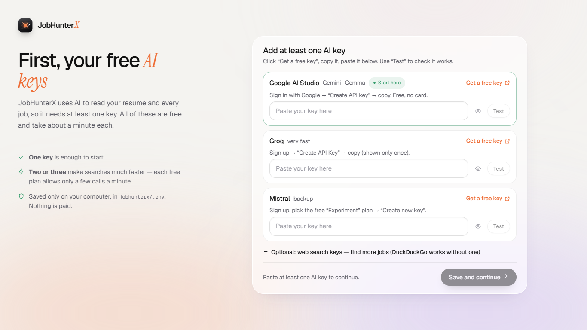
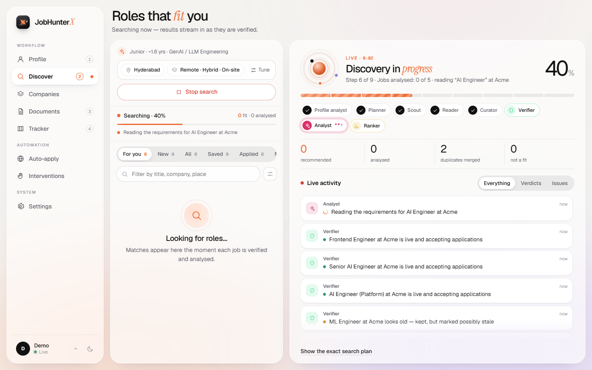
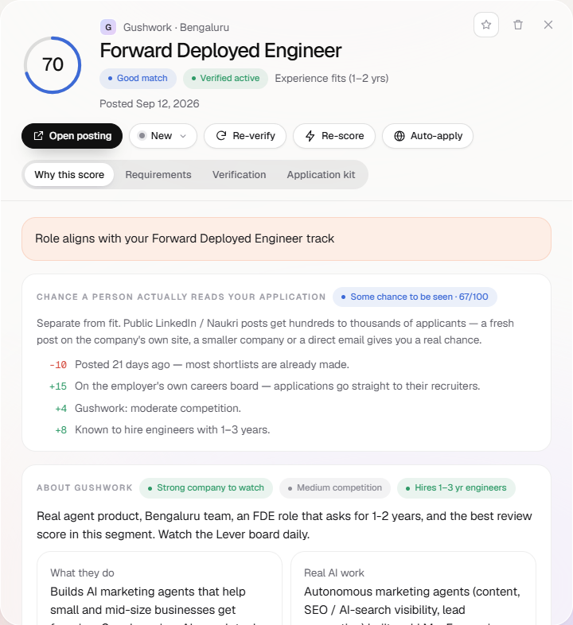
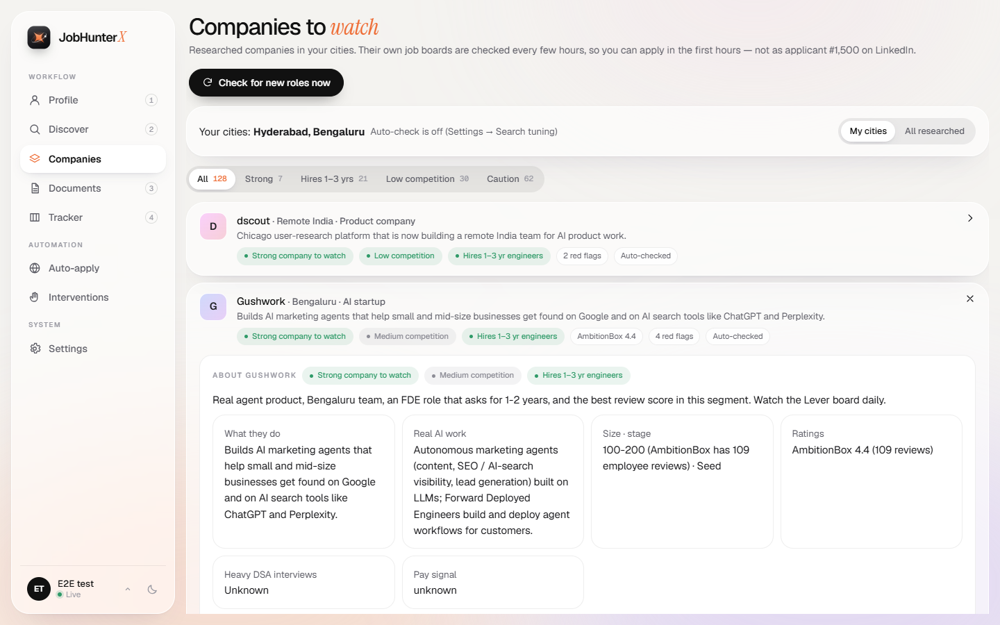
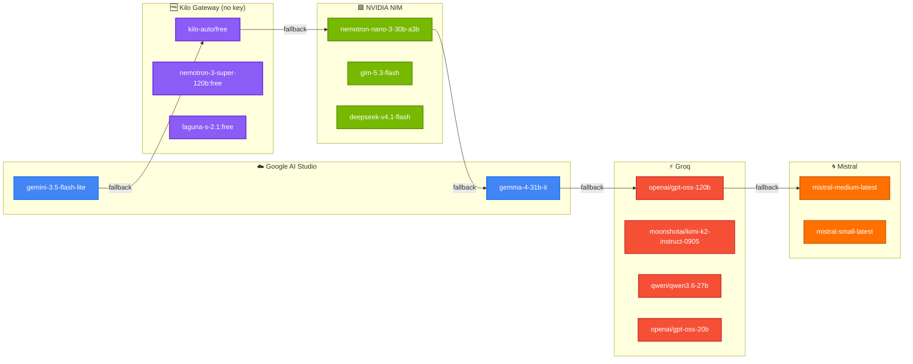

<div align="center">


<br/>


<p align="center">
  
</p>

<h3 align="center">🚀 AI career intelligence: understands your career, finds roles that genuinely fit, explains every match, and prepares honest application material</h3>

<br/>

<p align="center">
  <a href="https://python.org"></a>
  <a href="https://fastapi.tiangolo.com"></a>
  <a href="https://github.com/browser-use/browser-use"></a>
</p>

<p align="center">
  <a href="https://ai.google.dev/gemma/docs/core/gemma_on_gemini_api"></a>
  <a href="https://groq.com"></a>
  <a href="https://mistral.ai"></a>
  <a href="https://kilo.ai"></a>
  <a href="https://build.nvidia.com"></a>
  
</p>

<p align="center">
  
  
  
  
</p>

<p align="center">
  
  
  
</p>

<br/>


<br/>

<table>
<tr><td align="center">

*Upload your resume once. Press search. Go grab a coffee.* ☕

**JobHunterX** reads your resume, finds real jobs that truly fit you, tells you *why* each one fits (or doesn't),
writes an honest one-page resume, a cover letter and a CV for you — and then a browser agent fills the application
**live, right inside the app**, while you watch. Stuck on a CAPTCHA or a login? Just take over, fix it, and hand it back. 🙌

### 💜 *The job-hunting buddy you always wished you had.* 💜

</td></tr>
</table>

<br/>

<a href="#-quickstart"></a>
<a href="#️-the-whole-journey"></a>
<a href="#-auto-apply--the-browser-agent"></a>
<a href="#-api-reference"></a>

</div>

<br/>

<details open>
<summary><b>📚 What's inside</b></summary>
<br/>

| Start here | Under the hood | For developers |
|:--|:--|:--|
| 🇮🇳 [Built for Indian job seekers](#-built-for-indian-job-seekers) | 📡 [Chance to be seen](#-chance-to-be-seen-reach) | 📐 [Architecture](#-architecture) |
| ⚡ [Quickstart — one command](#-quickstart) | 🧠 [How matching works](#-how-matching-works) | 🔌 [API reference](#-api-reference) |
| 🗺️ [The whole journey](#️-the-whole-journey) | 📄 [Resume vs CV vs cover letter](#-resume-vs-cv-vs-cover-letter) | 🧪 [Testing](#-testing) |
| 📸 [A tour, step by step](#-a-tour-step-by-step) | 🤖 [AI models & free limits](#-llm-models--provider-architecture) | 🎨 [Design: fonts & themes](#-design-fonts--themes) |
| 🤖 [Auto-apply](#-auto-apply--the-browser-agent) | 🌐 [Job sources](#-job-sources--verification) | |

</details>

<br/>
<div align="center"></div>
<br/>

## 🇮🇳 Built for Indian job seekers

JobHunterX is made for people like this: **1–3 years of experience, living in South India
(Hyderabad / Bengaluru first), who can't move North or abroad for a job.**

**The real problem it solves:** a public LinkedIn / Naukri / Indeed post now gets hundreds to thousands
of applicants within days. Recruiters read the first few dozen and filter on years, current company and
notice period. With 1–2 years of experience you are filtered out unread — your skills never reach a human.
So "apply to more jobs" does not work. **Being seen early, on the right channel, does.**

| What it does | Why it helps |
|:--|:--|
| 🏢 **Company watchlist** — 130 researched companies in Hyderabad, Bengaluru and remote-India (AI startups, product companies, GCCs) | Each one has: what real AI work happens there, whether it hires 1–3 year engineers, AmbitionBox / Glassdoor ratings, what employees say, red flags (layoffs, bad reviews), how crowded applying is |
| ⏱️ **Checks their own job boards every 4 hours** while the app is open | New roles land in the **New** tab within hours — you apply among the first, not as applicant #1,500 |
| 📡 **Chance-to-be-seen score** next to every fit score | A fresh post on the company's site = good chance. A 3-week-old LinkedIn post with 300 applicants = low chance. You see this before you spend time |
| 🚫 **Mass IT-services recruiters are excluded** (TCS, Infosys, Wipro, HCL, Cognizant, Accenture…) | Bulk hiring, huge crowds, little real product AI work — marked "Not a fit" with the reason |
| 💰 **Indian salaries understood** — "12–18 LPA", "₹12L", "1.2 Cr", per month | Your minimum CTC is checked properly (type `14` in the salary box and it means 14 LPA) |
| ⏳ **Notice period aware** | "Immediate joiners only" posts are flagged when your notice is 45+ days |
| 🌍 **India only** | Jobs outside your country are dropped before scoring, so they never push out Indian roles |

> [!NOTE]
> The watchlist covers **Hyderabad, Bengaluru and remote-India** today. More South Indian cities (Chennai, Kochi,
> Coimbatore, Vizag…) come next. The research lives in `jobhunterx/jobhunterx/watchlist/companies.json`.

<br/>
<div align="center"></div>
<br/>

## 🗺️ The whole journey

Everything happens in this order — the sidebar is ordered the same way. 👇


```mermaid
flowchart LR
    K(["🔑 Free AI key<br/><sub>first screen</sub>"]) --> A(["📄 Upload resume<br/><sub>once</sub>"])
    A --> B["🙋 Check what<br/>we understood"]
    B --> C["🎯 Your goals<br/><sub>titles · cities · remote · CTC</sub>"]
    C --> D["🔎 Search + watchlist<br/><sub>real live progress</sub>"]
    D --> E["⭐ Pick a job<br/><sub>see why it fits</sub>"]
    E --> F["📝 Documents<br/><sub>resume · letter · CV</sub>"]
    F --> G["🤖 Auto-apply<br/><sub>live in the app</sub>"]
    G -->|"CAPTCHA / login"| H["🙌 You take over"]
    H -->|"give back"| G
    G --> I(["🎉 Applied!<br/><sub>tracked for you</sub>"])

    classDef start fill:#EE6B33,stroke:#c4501d,color:#fff,stroke-width:2px;
    classDef step fill:#fff7f2,stroke:#EE6B33,color:#1f1f24,stroke-width:1.5px;
    classDef agent fill:#1f1f24,stroke:#1f1f24,color:#fff,stroke-width:2px;
    classDef you fill:#fde9b8,stroke:#c4860f,color:#1f1f24,stroke-width:1.5px;
    classDef done fill:#2f9a68,stroke:#21754f,color:#fff,stroke-width:2px;
    class K,A start; class B,C,D,E,F step; class G agent; class H you; class I done;
```

| Step | What you do | What JobHunterX does |
|:--:|:--|:--|
| 0️⃣ | Paste one free AI key — or press **Start free** | The first screen links to Google AI Studio / NVIDIA / Groq / Mistral, tests the key and saves it. **Start free** uses Kilo's free models with no key |
| 1️⃣ | Upload your resume PDF | Reads it in the background (with live progress) and builds your profile |
| 2️⃣ | Check "how we see you" | Shows total experience, **with and without internships**, every role, contact and location |
| 3️⃣ | Add goals | Many job titles, many cities, remote / hybrid / relocation, current & expected CTC, notice period |
| 4️⃣ | Press **Search now** | Finds postings (web + your watchlist companies' own boards), checks they are real and open, reads each one, scores fit **and** chance to be seen — live |
| ⏱️ | Nothing — it runs by itself | Every 4 hours it checks the watchlist companies again; new matches appear in the **New** tab |
| 5️⃣ | Open a job | Explains the score (what fits, what's missing, what's unknown), the chance a person reads your application, and what the company is like |
| 6️⃣ | Press **Auto-apply** | Checks your documents → writes the missing ones → opens the browser agent **inside the app** |
| 7️⃣ | Watch (or take over) | The agent fills the form; you can stop, take over, continue or finish it yourself |
| 8️⃣ | Relax 😌 | The job moves to **Applied** in your tracker |

<br/>
<div align="center"></div>
<br/>

## 📸 A tour, step by step

<div align="center">

#### 0 · First run: one free AI key 🔑

<br/><sub><i>No key yet? Press <b>Start free</b> to use Kilo's free models right away, or get a free key: the screen shows where, tests it with one call and saves it to <code>.env</code>. Placeholder values never count as a key.</i></sub>
<br/><br/>

#### 1 · Who's searching? 👥

<br/><sub><i>Several people (or personas) can use one install — each profile keeps its own resume, matches, tracker and documents.</i></sub>
<br/><br/>

#### 2 · Upload your resume — only once 📄

<br/><sub><i>A short 5-step setup: resume → about you → goals → pay & availability → first search. Reload any time; it remembers where you were.</i></sub>
<br/><br/>

#### 3 · "Here's how we see you" 🙋

<br/><sub><i>Experience is calculated from your dates — total, professional only, and internships — so the numbers are never guessed.</i></sub>
<br/><br/>

#### 4 · Search, live 🔎

<br/><sub><i>Real progress only: the bar and the text move with real counts the server reports — "Web searches: 7 of 15", "Company job boards: 21 of 33", "Jobs analysed: 3 of 20 · reading 'AI Engineer' at …". Nothing is estimated from time.</i></sub>
<br/><br/>

#### 5 · Why this score? ⭐

<br/><sub><i>Click a job and it opens beside the list: hard requirements, the weighted score, requirements, verification and the application kit.</i></sub>
<br/><br/>

#### 5b · Chance to be seen + what the company is like 📡

<br/><sub><i>Every signal is listed with its points: how fresh the post is, which channel it is on, applicant counts (only when the page shows one), email routes, notice period, competition — plus the researched company card.</i></sub>
<br/><br/>

#### 5c · Companies to watch 🏢

<br/><sub><i>The researched watchlist for your cities: verdict, competition, early-career hiring, ratings, red flags. "Check for new roles now" shows the check live, step by step.</i></sub>
<br/><br/>

#### 6 · Honest documents 📝

<br/><sub><i>Every AI edit is fact-checked against your profile. "What changed" shows each edit — accepted or rejected, and why.</i></sub>
<br/><br/>

#### 7 · Auto-apply: documents first ✅

<br/><sub><i>Before the browser opens, the kit is checked: resume (one page), cover letter and CV. Anything missing is written right then.</i></sub>
<br/><br/>

#### 8 · Auto-apply: watch it work, live 🤖

<br/><sub><i>No extra Chrome window — the browser is streamed into the app. Every step is listed in plain words, with what was clicked and typed.</i></sub>
<br/><br/>

#### 9 · When it needs you 🙌

<br/><sub><i>CAPTCHA or login? Take over, click and type right in the view, then press Continue. Progress is saved, so nothing starts over.</i></sub>
<br/><br/>

#### 10 · Track everything 📊

<br/><sub><i>The whole journey in one stage bar, one-click "next stage", and the job beside the list — no sideways scrolling.</i></sub>
<br/><br/>

#### 11 · Your profile, your settings ⚙️

<br/><br/>

<br/><br/>

<br/><sub><i>Turn providers on/off, add keys (loaded from <code>.env</code>), pick a model per task, choose which documents Auto-apply attaches.</i></sub>
<br/><br/>

#### 12 · Dark mode & phones 🌙📱

<br/><br/>

<br/><sub><i>One click for dark mode. On phones the sidebar becomes a floating bottom bar.</i></sub>

</div>

<br/>
<div align="center"></div>
<br/>

## 🤖 Auto-apply — the browser agent

Press **Auto-apply** on any job and three things happen, in this order:


```mermaid
flowchart TD
    S(["▶️ Auto-apply"]) --> K{"📂 Check the kit"}
    K -->|"resume missing?"| R["✍️ Write a one-page resume"]
    K -->|"cover letter missing?"| L["✍️ Write a cover letter"]
    K -->|"CV missing?"| V["✍️ Write the CV"]
    K -->|"all ready"| O
    R --> O
    L --> O
    V --> O
    O["🌐 Open a private browser<br/><sub>streamed into the app</sub>"] --> F["⌨️ Fill the form<br/><sub>step by step</sub>"]
    F -->|"submitted"| A(["🎉 Applied"])
    F -->|"CAPTCHA · login · code"| N["🙌 Needs you"]
    F -->|"⏹ you press Stop"| X["⏸ Stopped — progress saved"]
    N -->|"take over, then Continue"| F
    X -->|"Continue"| F

    classDef go fill:#EE6B33,stroke:#c4501d,color:#fff;
    classDef kit fill:#fff7f2,stroke:#EE6B33,color:#1f1f24;
    classDef run fill:#1f1f24,stroke:#1f1f24,color:#fff;
    classDef wait fill:#fde9b8,stroke:#c4860f,color:#1f1f24;
    classDef ok fill:#2f9a68,stroke:#21754f,color:#fff;
    class S go; class K,R,L,V kit; class O,F run; class N,X wait; class A ok;
```

| Button | What it does |
|:--|:--|
| ⏹ **Stop now** | Stops **at once** (it does not wait for the current step). The browser stays open and every step is saved. |
| ✋ **Take over** | Pauses the agent. Your clicks, scrolling and typing go straight to the page in the live view. |
| ▶️ **Give back to agent** | The agent carries on from exactly where you left it. |
| ▶️ **Continue** | After a stop, a CAPTCHA or even an app restart: starts again **from the last page**, knowing what was already done. |
| ✅ **I submitted it** | You finished it yourself — the job is marked **Applied**. |
| ✖️ **Close browser** | Closes the private browser. Your steps stay saved. |

**Why it feels calm and clean** ✨

- 🪟 **No separate Chrome window.** The page is streamed with Chrome's own screencast into the Auto-apply tab. (Want a real window for debugging? Settings → Auto-apply → *Also show a separate Chrome window*.)
- 🧾 **Readable steps.** Each step shows the goal in plain words ("Fill in email and phone") with small chips for what was done ("Type … into Email", "Upload Asha_Rao_Resume.pdf"). Repeats are counted (×2) instead of listed again.
- 🧵 **One owner for the browser.** The agent, the live view and your clicks all run on one dedicated browser thread, so they never fight over the connection (this fixed the old *"navigation timed out"* and *"duplicate response"* errors).
- 💾 **Saved state.** Status, the kit, every step and the last page are stored in the database — reload the app, restart it, or switch tabs and pick up right where you were.
- 🐢 **Polite pacing.** A small pause between steps looks human and keeps you inside free AI limits (`BROWSER_STEP_DELAY_S`).

**Forms Indian applications actually have** 🇮🇳

- ☑️ **Checkboxes that really tick.** Many sites hide the real checkbox and draw a styled one, so it never appears in the
  agent's element list. The agent has two actions for this: `set_checkbox` (by element) and `set_checkbox_by_text`
  (by the words next to the box — finds hidden boxes, ARIA switches and same-site frames). Both read the box's real
  state before and after, so a second click never unticks a consent box by accident.
- 🎓 **College ≠ university.** Your profile keeps the college you attended and its affiliating university separately
  (e.g. *CVR College of Engineering*, affiliated to *JNTU Hyderabad*). A "College" field gets the college, a
  "University" field the university. In a dropdown the agent first searches for your exact college name (and one short
  variant), and only picks "Other" and types it when it is truly not listed.
- 📞 **Phone numbers without double codes.** The agent gets your number split into country code (+91) and the number.
  If the form has a separate country-code picker or a "+91" prefix, it types only the 10 digits; a single plain field
  gets the full international number — never "+91 +91…".

<details>
<summary><b>🛡️ Stealth & safety details</b></summary>
<br/>

- 🍪 Persistent private profile (`data/browser_profile`) so cookies build trust over time
- 🖥️ Normal desktop user-agent, automation flags hidden
- 🧹 Old/zombie Chrome processes and stale lock files are cleaned before each launch
- 🔐 Passwords and one-time codes are shown as `••••` in the step log
- 🔑 Optional email OTP reader for verification codes (`EMAIL_*` settings)

</details>

<br/>
<div align="center"></div>
<br/>

## 🧠 How matching works

JobHunterX does **not** just count shared keywords. It understands you, finds and checks real postings, reads each job,
and explains whether it genuinely fits.

<details>
<summary><b>🔍 The 9 stages of every search (click to open)</b></summary>
<br/>

| # | Stage | What happens | Where |
|---|-------|--------------|-------|
| 1 | **Understand** | The AI reads your profile into a validated structure: career tracks (with how close adjacent tracks are), realistic titles, skills with *evidence* (used at work / in projects / only listed), normalized locations. Years of experience are **computed from your dates** (overlaps merged, internships separate). Every AI claim is checked against your profile — invented skills are dropped. | `intelligence/candidate.py` |
| 2 | **Plan** | Diverse queries from your own titles and places, anchored on employers' own hiring systems (`site:` Greenhouse / Lever / Ashby / …). | `discovery/search.py` |
| 3 | **Discover** | Web search results are treated as *leads only*. Employer job boards found in results — and every watchlist company's board in your cities — are read via their public APIs. Jobs outside your country are dropped here. | `discovery/search.py`, `discovery/ats.py`, `discovery/watchlist.py` |
| 4 | **Normalize** | Every lead becomes one `JobPosting`: ATS API → schema.org JSON-LD → page text, in that order of trust. | `discovery/page.py` |
| 5 | **Dedupe** | Same job from many places is merged (ATS id, canonical URL, company+title+place, near-identical text); the first-party source wins and all sources are kept. | `discovery/dedupe.py` |
| 6 | **Validate** | Is it real, reachable, current, open? Per-field status: *verified / inferred / unverified / unknown / failed*. Unknown stays unknown. | `discovery/validate.py` |
| 7 | **Extract** | The AI reads the JD into a schema (required vs nice-to-have vs mandatory skills, experience, education, notice period, salary…). A skill is accepted only if it appears in the JD; experience/salary only with a verbatim quote that contains the number. Cached per JD. | `intelligence/job.py` |
| 8 | **Match** | Hard constraints first (career track, experience gap, seniority, location/work mode, mandatory skills, education, job open, notice, salary, excluded companies). **A failed hard constraint caps the score** — keyword overlap can never lift an incompatible job. Then weighted components (role, required/preferred skills by evidence strength, experience fit, responsibility overlap, seniority, location). | `intelligence/matching.py`, `intelligence/policy.py` |
| 9 | **Rank & explain** | Score 0–100, verdict (strong / good / stretch / weak / incompatible), strengths, gaps, unknowns, the exact reason a job was rejected — plus the separate chance-to-be-seen score. | `intelligence/reach.py`, UI: "Why this score" |

> [!NOTE]
> **No hardcoded skill or title vocabularies.** Skills, titles and career tracks come from the AI (schema-validated and
> verified against the source text); the code only compares and checks. The only fixed lists are deliberate, researched data:
> the company watchlist (`watchlist/companies.json`), the city names it covers, and the mass-recruiter exclusion list.
> Scoring weights and tolerances live in one tunable place: `intelligence/policy.py` (override with `MATCH_POLICY_JSON`).

</details>

### Example: one candidate, five jobs

Candidate: ~1.5 years professional AI/ML experience, Hyderabad, not relocating.

| Job | Result | Why |
|-----|--------|-----|
| AI Engineer · 0–2 yrs · Python/LLM/RAG · Hyderabad | **Strong match** | Same track, experience fits, all required skills demonstrated |
| Senior AI Engineer · 6+ yrs · same skills | **Incompatible** | "Requires 6+ years; you have ~1.6" — identical skills do not help |
| Frontend Engineer · React/TypeScript | **Incompatible** | Different career track |
| AI Engineer · 1–3 yrs · Berlin on-site | **Dropped** | Outside India — removed before scoring, so it never takes a result slot |
| AI Engineer · mandatory Kubernetes | **Incompatible** | "Mandatory: Kubernetes — not found in your profile" |

This exact scenario runs in the test suite (`tests/test_scenarios.py`).

### 📡 Chance to be seen (reach)

Fit answers *"am I right for this job?"*. Reach answers *"will a person actually read my application?"*.
It is shown next to fit and never mixed into the fit score. Every signal is shown with its reason:

| Signal | Raises the chance | Lowers the chance |
|:--|:--|:--|
| Freshness | Posted in the last 1–3 days | Older than 2–4 weeks |
| Channel | Company's own careers board / ATS; curated boards (Instahyre, Cutshort, Wellfound) | Public LinkedIn / Naukri / Indeed listing |
| Applicants | Page shows a small count | Page shows 50+ / 200+ applicants |
| Direct route | The JD gives an email to send your resume to | — |
| Notice period | — | "Immediate joiners" while your notice is longer |
| Company | Lesser-known company; known to hire 1–3 yr engineers | Famous brand (very crowded); mass IT-services recruiter |

The default sort, **Best chance**, ranks by fit *and* reach together. You can also sort by **Best fit** or **Least crowded**.

## 📄 Resume vs CV vs cover letter

They are three different documents — JobHunterX makes all three, and Auto-apply checks for them before it starts.

| | 📄 **Resume** | 📚 **CV** | ✉️ **Cover letter** |
|---|---|---|---|
| For | One job | Your whole career | One job |
| Length | **One page** (text shrinks first, then the least relevant points are trimmed) | Kept to **one page when possible** (roomy layout first, then tighter) | Under 300 words |
| What's in it | The points that matter most for *this* job | Every role, project, education, certificates, achievements | Links your real experience to what the job asks for |
| Code | `generation/resume.py` | `generation/cv.py` | `generation/cover_letter.py` |

🔗 **Links stay where they belong:** when your resume PDF is read, every link is kept together with the text on it
("Code", "Live demo", "Verify") and the lines around it. So a project keeps its GitHub *and* demo links, a certificate
keeps its credential link, and blog / Kaggle-style profiles go to the header. In the resume and CV they show up as small
clickable labels next to the right project or entry — nothing extra, no long raw URLs. You can edit them in Profile.

✅ **Nothing invented:** every AI-written line is fact-checked (`generation/evidence.py`). A new number, tool, employer
or claim that isn't in your profile is rejected and your own words are kept.

<br/>
<div align="center"></div>
<br/>

## 🤖 LLM Models & Provider Architecture

One router (`config/llm_router.py`) sends every AI call through a **task chain**: the first usable model answers, and the
next one takes over if it is busy, rate limited, turned off or not on your account. The model catalog, chains and free-tier
limits live in `config/models.py`.


```mermaid
graph LR
    subgraph Google["☁️ Google AI Studio"]
        G1["gemma-4-31b-it"]
        G2["gemini-3.5-flash-lite"]
    end
    subgraph Groq["⚡ Groq"]
        GR1["openai/gpt-oss-120b"]
        GR2["moonshotai/kimi-k2-instruct-0905"]
        GR3["qwen/qwen3.6-27b"]
        GR4["openai/gpt-oss-20b"]
    end
    subgraph Mistral["🌀 Mistral"]
        M1["mistral-medium-latest"]
        M2["mistral-small-latest"]
    end
    subgraph Kilo["🆓 Kilo Gateway (no key)"]
        K1["kilo-auto/free"]
        K2["nemotron-3-super-120b:free"]
        K3["laguna-s-2.1:free"]
    end
    subgraph NIM["🟩 NVIDIA NIM"]
        N1["nemotron-nano-3-30b-a3b"]
        N2["glm-5.3-flash"]
        N3["deepseek-v4.1-flash"]
    end
    G2 -->|fallback| K1 -->|fallback| N1 -->|fallback| G1 -->|fallback| GR1 -->|fallback| M1

    classDef google fill:#4285F4,stroke:#1a73e8,color:#fff,stroke-width:2px;
    classDef groq fill:#F55036,stroke:#c9302c,color:#fff,stroke-width:2px;
    classDef mistral fill:#FF7000,stroke:#cc5a00,color:#fff,stroke-width:2px;
    classDef kilo fill:#8B5CF6,stroke:#6d28d9,color:#fff,stroke-width:2px;
    classDef nim fill:#76B900,stroke:#5a8f00,color:#fff,stroke-width:2px;
    class K1,K2,K3 kilo;
    class N1,N2,N3 nim;
    class G1,G2 google;
    class GR1,GR2,GR3,GR4 groq;
    class M1,M2 mistral;
```

### Task chains

| Task (Settings label) | Chain | Model order |
|:--|:--|:--|
| Quick tasks | `fast` | Gemini 3.5 Flash Lite → **Kilo** (Auto, Nemotron 3 Super, Laguna S) → **NIM** (Nemotron Nano 3, GPT-OSS 20B) → Gemma 4 31B → Groq GPT-OSS 20B / Qwen → Mistral Small |
| Matching & analysis | `reasoning` | Gemini 3.5 Flash Lite → **Kilo** (Nemotron 3 Super, Auto, Ling Flash, Laguna S, Nemotron Nano Omni) → **NIM** (GLM 5.3 Flash, DeepSeek V4.1 Flash) → Gemma 4 31B → GPT-OSS 120B → Kimi K2 → Mistral Medium |
| Resume & letter writing | `tailoring` | Gemini 3.5 Flash Lite → **Kilo** (Nemotron 3 Super, Auto) → **NIM** (DeepSeek V4.1 Flash, GLM 5.3 Flash) → Gemma 4 31B → Kimi K2 → GPT-OSS 120B → Mistral Medium |
| Resume reading | `extraction` | same as Matching, then Qwen3.6 27B / Qwen3 32B → Mistral Medium |
| Browser agent | `browser` | Gemini 3.5 Flash Lite → GPT-OSS 120B → Mistral Small (→ Gemma 4 31B) |

**Kilo comes before NVIDIA NIM** on purpose: it needs no key and each Kilo model has its own 200 requests/hour, while NIM's
40 requests/minute is shared by every NIM model on your account. Kilo's free models are "thinking" models; the app turns
their thinking off (`reasoning: {enabled: false}`) — in tests that made them answer in about 1–3 s instead of running out
of room before the answer. If a model still returns an empty answer, it gets one retry with more room and is never
"rested" for it.

> [!WARNING]
> **Privacy:** Kilo's free models are marked *may train on your prompts*. Your resume text and job posts are sent in those
> prompts. If that matters to you, add any free key (Google, NVIDIA, Groq or Mistral) and turn Kilo off in
> **Settings → AI providers**.

Llama models are deliberately not used. In **Settings → AI providers** you can turn any provider off, add or replace its key,
pick the first model for each task, and press **Check available models** — the app asks each provider's `/models`
endpoint with your key and skips models your account cannot call.

### 💳 Free-tier limits the router respects

Each model gets its own limiter: requests are spaced to its **RPM**, a rolling one-minute window keeps it under **TPM**, and
daily **RPD / TPD** counters stop using it for the day once spent (the chain moves on). A 429 also puts the provider in a
short cooldown. Override any number with `MODEL_LIMITS_JSON` in `.env`, e.g.
`MODEL_LIMITS_JSON={"gemini/gemma-4-31b-it": {"rpm": 30, "rpd": 14400}}` — limits differ per account and change often.

| Provider | Model | RPM | Per day | TPM | Notes |
|:--|:--|:--|:--|:--|:--|
| Google AI Studio | `gemma-4-31b-it` | 15 | 1,500 req | — | Gemma runs on the Gemini API ([guide](https://ai.google.dev/gemma/docs/core/gemma_on_gemini_api)); no system role, so instructions are sent inline |
| Google AI Studio | `gemini-3.5-flash-lite` | 15 | 500 req | 250K | Fast; primary for the browser agent |
| Groq | `openai/gpt-oss-120b` | 30 | 1K req · 200K tok | 8K | Reasoning effort set to low |
| Groq | `moonshotai/kimi-k2-instruct-0905` | 60 | 1K req · 300K tok | 10K | Strong writing |
| Groq | `qwen/qwen3.6-27b` · `qwen/qwen3-32b` | 30 · 60 | 1K req | 8K · 6K | Reasoning trace hidden |
| Groq | `openai/gpt-oss-20b` | 30 | 1K req · 200K tok | 8K | Light and fast |
| Mistral | `mistral-medium-latest` | 50 | — | 25K | Free plan limits are per account (Admin console → Limits) |
| Mistral | `mistral-small-latest` | 50 | — | 50K | |
| Mistral | `mistral-large-latest` | 4 | — | 250K | Very low request rate on the free plan |
| Kilo Gateway | `kilo-auto/free` · `nvidia/nemotron-3-super-120b-a12b:free` · `poolside/laguna-s-2.1:free` · `inclusionai/ling-3.1-flash` · `nvidia/nemotron-3-nano-omni-30b-a3b-reasoning:free` | — | **200 req / hour per model** | — | No key. Measured 1–4 s per answer. May train on prompts |
| NVIDIA NIM | `nvidia/nemotron-nano-3-30b-a3b` · `openai/gpt-oss-20b` · `z-ai/glm-5.3-flash` · `deepseek-ai/deepseek-v4.1-flash` | **40 per account** | — | — | Free key at build.nvidia.com; the 40/min is shared by all NIM models, so the router counts it as one budget |

> [!NOTE]
> **Why you may see `500 INTERNAL` or `503 high demand` from Gemma:** those come from Google's servers. In live tests
> (Oct 2026) the free Gemma 4 31B endpoint took 12–120 s per answer and often refused larger prompts, while
> Gemini 3.5 Flash Lite answered in about 1–5 s. So **Flash Lite is now the first choice for every task** and Gemma 4 31B
> is the first backup. When Gemma fails it gets one quick retry, then the app moves on and Gemma **rests for 2 minutes**
> (4, 8… up to 30 if it keeps failing). Settings → AI providers shows "resting N min". A Gemma call never waits more
> than `GEMMA_TIMEOUT_S` (90 s).
> Resume upload runs in the background with live progress, so a slow free-tier call never times out the page.

<br/>
<div align="center"></div>
<br/>

## 🌐 Job Sources & Verification

| Source | Trust | How it is used |
|--------|-------|----------------|
| **Employer ATS APIs** — Greenhouse, Lever, Ashby, SmartRecruiters, Recruitee, Workable, **Workday** (most GCCs), **Oracle Recruiting** (JPMorgan and other large employers — filtered to India on the board itself), **Keka** (many Indian product companies) | First-party, **verified** | Structured postings; re-verified live by job id (a closed job disappears from the board / returns 404) |
| **Company watchlist** — 130 researched Hyderabad / Bengaluru / remote-India employers | Researched, sources linked | Their boards are read on every search and every 4 hours in the background; the research card is shown on each of their jobs |
| **schema.org JobPosting** on a page | Verified when the hiring organisation's site is the page's site; otherwise inferred | Title, company, location, dates, `validThrough`, remote eligibility, salary |
| **Other pages** (job boards, aggregators) | Unverified | Text only; if the page links to a supported ATS posting, that posting is used instead |
| **Web search** — TinyFish → Tavily → Exa → Brave → **Deep Search** (free) → DuckDuckGo | Leads only | Never shown as jobs until resolved by one of the above |

### 🔎 Deep Search — good results without any search key

Paid search APIs like Tavily and Exa do three things one free scraper does not: they ask several indexes, they read the
pages, and they rank by meaning. **Deep Search** (`tools/deep_search.py`) does the same with free parts, then does what
a general search API cannot: it turns what it finds into open postings on the employer's own job board.

1. **Understand the query** — role words, places (Hyderabad, Bengaluru… with their other names) and modifiers like
   "fresher" or "2 years" are told apart.
2. **Ask many engines, three ways** — the query goes to Bing, Yandex, Google and Brave (through Mullvad's proxies),
   Yahoo and DuckDuckGo, plus two rewrites: one aimed at ATS job pages (Greenhouse, Lever, Ashby, Workday, Keka) and one
   at company careers pages. A failing engine rests for 10 minutes, and a slow one gets 3 seconds once most have answered.
3. **Merge and sort the junk out** — reciprocal-rank fusion combines the lists. Each result is classified as a single
   posting, an aggregator's single job, a careers page, a *list* of jobs ("3,000+ jobs in…"), a salary page, someone's
   portfolio or profile, or a blog / guide. Lists come after everything real; salary pages, profiles and guides are dropped.
4. **Check it is still open** — each ATS posting is checked against the employer's own API: closed jobs are removed,
   and the real location and posting date replace the search snippet's guess. Jobs outside the searched place sink.
5. **Find the company's own board** — company names are read from aggregator posts ("Acme hiring AI Engineer…") and
   careers sites, matched against the researched watchlist or probed on Greenhouse / Lever / Ashby, and matching roles in
   your city are pulled straight from that board. What it learns about each company's board is remembered for a week.
6. **Open the pages** — the best careers pages are mined for job links, and the page's own job data (`JobPosting`:
   date posted, valid through, location) is read; expired postings sink, fresh ones rise ("2 days ago" beats "3 months").
7. **Rank by meaning** — the AI scores the top 30 for "one open posting that matches the role and place". It drops
   clear misfits when enough good results remain, and is skipped after 12 s so a slow model never holds the search up.

On four India queries (AI Engineer Hyderabad, ML Engineer Bengaluru, DevOps Hyderabad, Data Analyst fresher Bengaluru),
the old version returned 7 single postings, none on an employer's own board, and 31 aggregator pages out of 57 results.
This version returns 28 single postings, 21 on employer boards, and 4 aggregator pages out of 60.

Search queries now run 3 at a time, so a full search finishes much faster than one by one.

### 🧠 Smart search (the default)

Measured on the same India job queries (Oct 2026), Deep Search returned the most single job postings (16 of 30) and the
fewest job-board list pages; the keyed APIs mostly returned Naukri / LinkedIn / Indeed result pages (Exa: 19 of 30).
So **Smart** runs **Deep Search and one keyed provider together for every query** (keyed ones rotate so their free
credits are shared), merges the two lists, keeps at most 3 results per site, and lets the AI rank the combined list once.
With no keys it is simply Deep Search. *Fallback*, *Spread* and *Combine* are still in **Settings → Web search**.

After search, the pipeline keeps only what is worth your time:

1. **Skip job lists before reading them** — results titled "84 Linux jobs in Hyderabad" or "(426 open roles)" are lists,
   not jobs; results that name only a foreign place are skipped too.
2. **Location check for every posting** — web-search postings get the same "is this in your places (or remote from
   India)?" check as company-board jobs. "Remote · Belgium" means remote *in Belgium*.
3. **AI shortlist** — one quick AI call scores every posting 0–3 for *is this the candidate's field and level?* (not
   shared words like "Engineer"), so the deep analysis is spent on the right 60 jobs.
4. **Fair skill check** — skills named in your experience text count, everyday tools implied by a broader skill count as
   related (Linux → SSH, sudo, systemd, Ubuntu…), and a long "mandatory" tool list only rules a job out when most of it
   is missing. A short, explicit must-have still does.
5. **Skills under other names, and new ones** — for every job skill that doesn't match by name, the AI decides whether
   you already have it under another name (*same*: "Generative AI" for someone doing LLM / RAG work, "Vector databases"
   for FAISS) or have real related experience (*related*: CrewAI or Google ADK for LangGraph, A2A for MCP), and names
   the skill of yours behind it. If the model finds no link — often because a tool is newer than the model — the app
   reads a short description of it on the web and asks again. Every answer is remembered on disk
   (`intelligence/skill_links.py`), so a relationship is learned once and reused for every job and later search.

On a 12-year Linux / HPC infrastructure profile in Hyderabad this took a search from **5 to 22 recommended jobs**, all in
India (JPMorgan, Notion, Freshworks, HighRadius, S&P Global…), where before most web results were in the US or Europe.

Search providers are tried in priority order (primary first, DuckDuckGo last) with zero-spend protection
(`tools/zero_spend.py`) and a usage ledger. All fetching of untrusted URLs goes through an SSRF-safe client
(`discovery/net.py`: public addresses only, checked on every redirect, size and time limits).

<br/>
<div align="center"></div>
<br/>

## 🎨 Design: fonts & themes

| | |
|:--|:--|
| 🔤 **Fonts** | **Geist** for text, **Instrument Serif** for the warm accent word in each heading, **Geist Mono** for links and numbers — all bundled, no CDN |
| 🎨 **Colours** | Warm off-white canvas with a soft pastel wash, white cards, black pill buttons, one orange accent |
| 🌙 **Themes** | Light and dark, one click in the sidebar (or Settings → Appearance) |
| 🎞️ **Motion** | Orbit loader, resume "scan" beam, springy tabs, count-up numbers, self-drawing score rings, live step log. Settings → Appearance → Motion: *Full · Reduced · Follow system* |
| 🧭 **No long scrolling** | Every screen fits the window: list ⇄ detail, library ⇄ preview, nav ⇄ settings — panes scroll on their own |
| ♿ **Accessible** | Keyboard friendly, focus-trapped dialogs, live regions for progress and toasts |

<br/>
<div align="center"></div>
<br/>

## ⚡ Quickstart

### 🚀 One command (recommended)

Get the code, then run **one** command. It does everything for you:
installs `uv`, makes the virtual environment, installs all packages (~30 seconds),
creates the settings file, starts the app and opens it in your browser.

```bash
git clone https://github.com/kvcops/jobhunterx.git
cd jobhunterx
```

| Your computer | Run this |
|:--|:--|
| **Windows** | `powershell -ExecutionPolicy Bypass -File start.ps1` &nbsp;— or just **double-click `start.bat`** |
| **macOS / Linux** | `bash start.sh` |

The first screen asks for a **free AI key** and shows where to get it. That's it. 🎉

**Next time:** run the same command (or double-click `start.bat` again). It skips the setup and just starts the app.
**Stop the app:** press `Ctrl + C` in that window.

### What you need

- 🌐 **Internet** for the first setup
- 🌐 **Google Chrome**, used by Auto-apply
- 🔑 **One free AI key** — Google AI Studio is the easiest ([get it here](https://aistudio.google.com/apikey))

You don't need to install Python yourself — `uv` downloads Python 3.11 if it's missing.

<details>
<summary><b>Prefer doing it by hand? Step-by-step commands</b></summary>
<br/>

#### ① Get the code

```bash
git clone https://github.com/kvcops/jobhunterx.git
cd jobhunterx
```

#### ② Install `uv` (a fast installer)

`uv` installs everything in about 30 seconds. Plain `pip` can take a very long time here.

**Windows (PowerShell):**

```powershell
powershell -ExecutionPolicy ByPass -c "irm https://astral.sh/uv/install.ps1 | iex"
```

**macOS / Linux:**

```bash
curl -LsSf https://astral.sh/uv/install.sh | sh
```

Close the terminal and open a new one, then check it works: `uv --version`

> Can't run the installer? `pip install uv` works too.

#### ③ Make a virtual environment (venv)

A venv is a private folder for this project's packages, so they don't mix with other projects.

```bash
uv venv --python 3.11
```

This creates a `.venv` folder. If Python 3.11 is missing, `uv` downloads it.

Now **turn the venv on** (do this every time you open a new terminal):

| System | Command |
|:--|:--|
| Windows (PowerShell) | `.venv\Scripts\Activate.ps1` |
| Windows (Command Prompt) | `.venv\Scripts\activate.bat` |
| macOS / Linux | `source .venv/bin/activate` |

You will see `(.venv)` at the start of the line when it is on.

> PowerShell says "running scripts is disabled"? Run this once, then try again:
> `Set-ExecutionPolicy -Scope CurrentUser RemoteSigned`

#### ④ Install the packages

```bash
uv pip install -r requirements.txt
```

All versions are fixed on purpose, so this finishes in seconds instead of hours.

#### ⑤ Add your AI key

**Easy way:** skip this step. When you start the app, the first screen asks for your keys,
shows where to get each one for free, tests it, and saves it for you. Or press **Start free** to use
Kilo's free models with no key at all (they may use your prompts for training — see the privacy note above).

**Or do it by hand:** copy the example file and paste your key after the `=` sign.

```bash
# Windows
copy jobhunterx\.env.example jobhunterx\.env
# macOS / Linux
cp jobhunterx/.env.example jobhunterx/.env
```

```env
GOOGLE_API_KEY=paste-your-key-here     # free — start with this one
NVIDIA_API_KEY=                        # optional — 40 requests/min, fast small models
GROQ_API_KEY=                          # optional — makes it faster
MISTRAL_API_KEY=                       # optional — backup
```

> [!TIP]
> **Free keys:** [Google AI Studio](https://aistudio.google.com/apikey) · [NVIDIA NIM](https://build.nvidia.com/settings/api-keys) · [Groq](https://console.groq.com/keys) · [Mistral](https://console.mistral.ai/api-keys). No key at all? Kilo's free models work out of the box.
> One key is enough. Two or three make searches much faster, because each free plan allows only a few calls per minute.

#### ⑥ Start

```bash
cd jobhunterx
python -m jobhunterx.api.main
```

<div align="center">

### Open **[http://127.0.0.1:8000](http://127.0.0.1:8000)** and start hunting. 🎯

</div>

**Next time**, you only need: open a terminal in the project folder → turn the venv on (step ③) → `cd jobhunterx` → `python -m jobhunterx.api.main`.

> **Stop the app:** press `Ctrl + C` in the terminal.

</details>

### 🆘 If something goes wrong

| Problem | Fix |
|:--|:--|
| Resume upload keeps loading | No real AI key. Restart the app — the first screen asks for one. Keys like `your_gemini_api_key` don't count. |
| `pip install` takes forever | Use `uv pip install -r requirements.txt` (step ④). |
| `uv` not found | Close and reopen the terminal after installing it, or use `pip install uv`. |
| `No module named jobhunterx` | Run the start command from inside the inner `jobhunterx` folder (`cd jobhunterx`), with the venv on. |
| Port 8000 is busy | Set `PORT=8001` in `jobhunterx/.env` and open `http://127.0.0.1:8001`. |
| Auto-apply can't open a browser | Install [Google Chrome](https://www.google.com/chrome/). |
| Searches are slow | Add a second free AI key (Groq). Free plans allow only a few calls per minute each. |

### ⚙️ Handy settings (`.env` or Settings page)

| Setting | Default | What it means |
|:--|:--|:--|
| `APPLY_WITH_COVER_LETTER` | `true` | Write and attach a cover letter when applying |
| `APPLY_WITH_CV` | `true` | Write and attach your CV when a form asks for one |
| `BROWSER_MAX_STEPS` | `40` | Most steps per Auto-apply run |
| `BROWSER_STEP_DELAY_S` | `3` | Pause between agent steps (seconds) |
| `BROWSER_SHOW_WINDOW` | `false` | Also open a real Chrome window (debugging only) |
| `MAX_JOBS_PER_SEARCH` | see `.env.example` | How many jobs one search analyses |
| `MODEL_LIMITS_JSON` | — | Override any model's free-tier limits |

<br/>
<div align="center"></div>
<br/>

## 📐 Architecture

```
jobhunterx/jobhunterx/
├── domain/          # 📦 Data contracts: profile, snapshot, job posting, match, document
├── intelligence/    # 🧠 Understanding + judgement (candidate, job, matching, reach, policy)
├── discovery/       # 🔎 Search, ATS adapters (incl. Workday, Keka), watchlist, page parsing, dedupe, validation, SSRF-safe fetch
├── watchlist/       # 🏢 companies.json — the researched company watchlist (Hyderabad, Bengaluru, remote India)
├── generation/      # 📝 Resume / CV / cover letter + fact-checking + one-page PDF rendering
├── services/        # 🧩 Orchestration: search runs, watchlist watcher, jobs, documents, profiles, auto-apply kit
├── agents/
│   ├── browser_agent.py   # 🤖 Auto-apply session: steps, stop / take over / continue / close
│   ├── browser_worker.py  # 🧵 One long-lived thread that owns the browser
│   └── live_view.py       # 📺 Chrome screencast → the app, your clicks → the page
├── storage.py       # 💾 SQLite: jobs, documents, people, search runs, apply sessions (+ migrations)
├── db_health.py     # 🩺 Check, repair and back up the database on every start
├── api/             # 🔌 FastAPI routes, WebSockets (/ws events, /ws/browser live view)
├── config/          # ⚙️ Settings, model catalog & limits, LLM router, app state
└── web/             # 🎨 Preact + htm UI with bundled fonts — no build step
```

* 🚀 **One command to run it:** `start.ps1` / `start.bat` (Windows) and `start.sh` (macOS / Linux) set up uv, the venv and packages, check that everything loads, start the app, and open the browser only once it answers.
* 🔁 **One search at a time**; every event carries its run id, so old results never leak into a new search. Background watchlist checks never interrupt a search you started.
* 📶 **Real progress only:** progress is streamed as real counts (`search.progress` events), never estimated from time.
* 💸 **Low AI cost:** profile understanding and job reading are cached, role-fit is batched, out-of-country jobs are dropped before any AI call, watchlist checks read only new postings (20 per check), and a provider whose key is rejected is skipped instead of retried.
* 🔒 **Secure by default:** same-origin CORS, CSRF guard, WebSocket origin checks, SSRF-safe fetching, upload limits, autoescaped templates.

<br/>
<div align="center"></div>
<br/>

## 🔌 API Reference

The full contract (REST + WebSocket) is in [`jobhunterx/docs/API.md`](jobhunterx/docs/API.md).

| Group | Endpoints |
|-------|-----------|
| 👤 Profile | `GET/PUT /api/profile`, `POST /api/profile/upload`, people: `GET/POST /api/people`, `POST /api/people/{id}/activate` |
| 🔑 Setup | `GET /api/setup` (which keys are set), `POST /api/setup/test-key` (one free call to check a key) |
| 🔎 Searches | `POST /api/searches`, `GET /api/searches/current`, `GET /api/searches/{id}`, `POST /api/searches/{id}/cancel` |
| 🏢 Watchlist | `GET /api/watchlist?scope=mine` or `scope=all`, `POST /api/watchlist/check` |
| 💼 Jobs | `GET /api/jobs` (views incl. `fresh`; sorts `chance` · `score` · `reach` · `recent`), `GET /api/jobs/{id}`, `PUT/DELETE /api/jobs/{id}/saved`, `PATCH /api/jobs/{id}`, `POST /api/jobs/{id}/verify`, `POST /api/jobs/{id}/rescore` |
| 📝 Documents | `POST /api/jobs/{id}/documents`, `POST /api/documents/cv`, `GET /api/documents`, `GET /api/documents/{id}/pdf` |
| 🤖 Auto-apply | `POST /api/jobs/{id}/apply`, `GET /api/apply/current`, `POST /api/apply/{job_id}/stop · take-over · release · continue · close · done`, `WS /ws/browser` |
| ⚙️ System | settings, providers, models, usage, database health / repair / backup, interventions, reset |
| 📡 Live events (`WS /ws`) | `search.run`, `search.progress` (real done / total per stage), `search.activity`, `search.job`, `watch.status`, `watch.done`, `job.updated`, `document.status`, `profile.upload`, `apply.session` |

<br/>
<div align="center"></div>
<br/>

## 🧪 Testing

```bash
# with the venv on (see Quickstart)
cd jobhunterx
python -m pytest -q --ignore=tests/frontend      # fast: API, pipeline scenarios, parsers

uv pip install playwright                        # only needed for the browser UI tests
python -m pytest -q tests/frontend
```

* `tests/test_scenarios.py` — the full pipeline on a realistic candidate (fake network + fake AI, including made-up claims that must be rejected)
* `tests/test_api_v2.py` — API contract, errors, cancellation, CSRF / WebSocket / SSRF guards
* `tests/frontend/test_ui.py` — Playwright against the real app

<br/>

<div align="center">


<br/>
<br/>

## 📜 License

**MIT License** — Build on it, fork it, make it yours.

Built with ❤️ and an unhealthy amount of caffeine for job seekers who refuse to waste time on repetitive applications.

<br/>

### ⭐ Star this repo if JobHunterX saved you from the soul-crushing grind of manual job applications

<br/>

<a href="https://github.com/kvcops/jobhunterx/stargazers"></a>
<a href="https://github.com/kvcops/jobhunterx/fork"></a>
<a href="https://github.com/kvcops/jobhunterx/issues"></a>

<br/>
<br/>


</div>
