<div align="center">

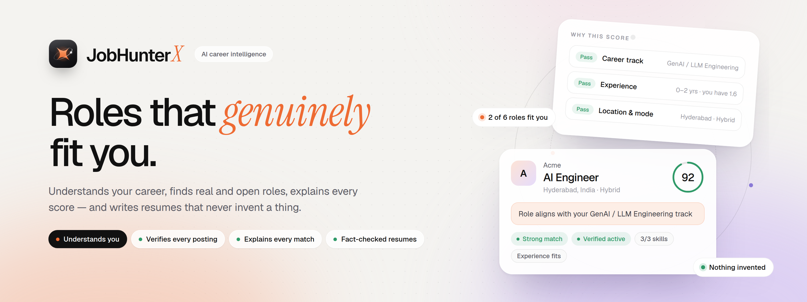

<br/>


<p align="center">
  
</p>

<h3 align="center">🚀 AI career intelligence: understands your career, finds roles that genuinely fit, explains every match, and prepares honest application material</h3>

<br/>

<p align="center">
  <a href="https://python.org"></a>
  <a href="https://fastapi.tiangolo.com"></a>
  <a href="https://github.com/browser-use/browser-use"></a>
</p>

<p align="center">
  <a href="https://ai.google.dev/gemma/docs/core/gemma_on_gemini_api"></a>
  <a href="https://groq.com"></a>
  <a href="https://mistral.ai"></a>
  
</p>

<p align="center">
  
  
  
  
</p>

<p align="center">
  
  
  
</p>

<br/>


<br/>

<table>
<tr><td align="center">

*Upload your resume once. Press search. Go grab a coffee.* ☕

**JobHunterX** reads your resume, finds real jobs that truly fit you, tells you *why* each one fits (or doesn't),
writes an honest one-page resume, a cover letter and a CV for you — and then a browser agent fills the application
**live, right inside the app**, while you watch. Stuck on a CAPTCHA or a login? Just take over, fix it, and hand it back. 🙌

### 💜 *The job-hunting buddy you always wished you had.* 💜

</td></tr>
</table>

<br/>

<a href="#-quickstart"></a>
<a href="#️-the-whole-journey"></a>
<a href="#-auto-apply--the-browser-agent"></a>
<a href="#-api-reference"></a>

</div>

<br/>

<details open>
<summary><b>📚 What's inside</b></summary>
<br/>

| Start here | Under the hood | For developers |
|:--|:--|:--|
| 🗺️ [The whole journey](#️-the-whole-journey) | 🧠 [How matching works](#-how-matching-works) | 📐 [Architecture](#-architecture) |
| 📸 [A tour, step by step](#-a-tour-step-by-step) | 📄 [Resume vs CV vs cover letter](#-resume-vs-cv-vs-cover-letter) | 🔌 [API reference](#-api-reference) |
| 🤖 [Auto-apply](#-auto-apply--the-browser-agent) | 🤖 [AI models & free limits](#-llm-models--provider-architecture) | 🧪 [Testing](#-testing) |
| ⚡ [Quickstart](#-quickstart) | 🌐 [Job sources](#-job-sources--verification) | 🎨 [Design: fonts & themes](#-design-fonts--themes) |

</details>

<br/>
<div align="center"></div>
<br/>

## 🗺️ The whole journey

Everything happens in this order — the sidebar is ordered the same way. 👇

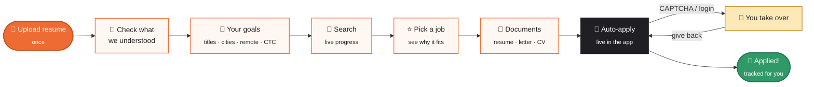
```mermaid
flowchart LR
    A(["📄 Upload resume<br/><sub>once</sub>"]) --> B["🙋 Check what<br/>we understood"]
    B --> C["🎯 Your goals<br/><sub>titles · cities · remote · CTC</sub>"]
    C --> D["🔎 Search<br/><sub>live progress</sub>"]
    D --> E["⭐ Pick a job<br/><sub>see why it fits</sub>"]
    E --> F["📝 Documents<br/><sub>resume · letter · CV</sub>"]
    F --> G["🤖 Auto-apply<br/><sub>live in the app</sub>"]
    G -->|"CAPTCHA / login"| H["🙌 You take over"]
    H -->|"give back"| G
    G --> I(["🎉 Applied!<br/><sub>tracked for you</sub>"])

    classDef start fill:#EE6B33,stroke:#c4501d,color:#fff,stroke-width:2px;
    classDef step fill:#fff7f2,stroke:#EE6B33,color:#1f1f24,stroke-width:1.5px;
    classDef agent fill:#1f1f24,stroke:#1f1f24,color:#fff,stroke-width:2px;
    classDef you fill:#fde9b8,stroke:#c4860f,color:#1f1f24,stroke-width:1.5px;
    classDef done fill:#2f9a68,stroke:#21754f,color:#fff,stroke-width:2px;
    class A start; class B,C,D,E,F step; class G agent; class H you; class I done;
```

| Step | What you do | What JobHunterX does |
|:--:|:--|:--|
| 1️⃣ | Upload your resume PDF | Reads it in the background (with live progress) and builds your profile |
| 2️⃣ | Check "how we see you" | Shows total experience, **with and without internships**, every role, contact and location |
| 3️⃣ | Add goals | Many job titles, many cities, remote / hybrid / relocation, current & expected CTC, notice period |
| 4️⃣ | Press **Search now** | Finds postings, checks they are real and still open, reads each one, scores it — live |
| 5️⃣ | Open a job | Explains the score: what fits, what's missing, what's unknown |
| 6️⃣ | Press **Auto-apply** | Checks your documents → writes the missing ones → opens the browser agent **inside the app** |
| 7️⃣ | Watch (or take over) | The agent fills the form; you can stop, take over, continue or finish it yourself |
| 8️⃣ | Relax 😌 | The job moves to **Applied** in your tracker |

<br/>
<div align="center"></div>
<br/>

## 📸 A tour, step by step

<div align="center">

#### 1 · Who's searching? 👥
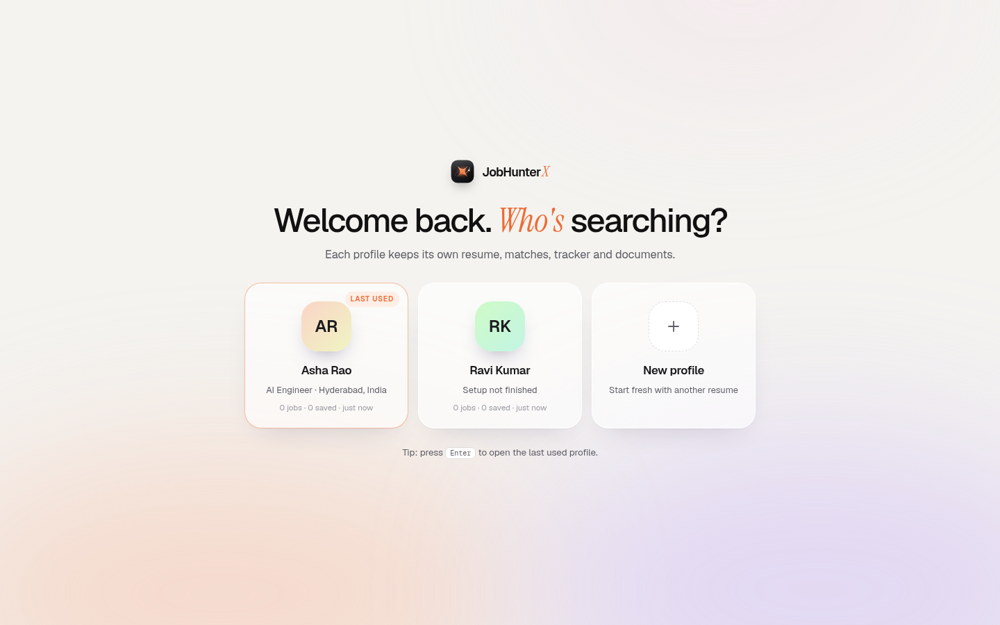
<br/><sub><i>Several people (or personas) can use one install — each profile keeps its own resume, matches, tracker and documents.</i></sub>
<br/><br/>

#### 2 · Upload your resume — only once 📄

<br/><sub><i>A short 5-step setup: resume → about you → goals → pay & availability → first search. Reload any time; it remembers where you were.</i></sub>
<br/><br/>

#### 3 · "Here's how we see you" 🙋

<br/><sub><i>Experience is calculated from your dates — total, professional only, and internships — so the numbers are never guessed.</i></sub>
<br/><br/>

#### 4 · Search, live 🔎

<br/><sub><i>Progress %, a timer, which agent is working right now, and a plain-English feed of what is happening.</i></sub>
<br/><br/>

#### 5 · Why this score? ⭐

<br/><sub><i>Click a job and it opens beside the list: hard requirements, the weighted score, requirements, verification and the application kit.</i></sub>
<br/><br/>

#### 6 · Honest documents 📝

<br/><sub><i>Every AI edit is fact-checked against your profile. "What changed" shows each edit — accepted or rejected, and why.</i></sub>
<br/><br/>

#### 7 · Auto-apply: documents first ✅
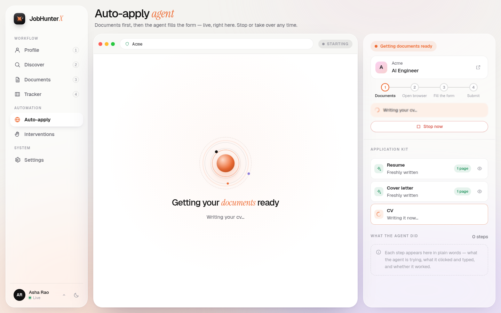
<br/><sub><i>Before the browser opens, the kit is checked: resume (one page), cover letter and CV. Anything missing is written right then.</i></sub>
<br/><br/>

#### 8 · Auto-apply: watch it work, live 🤖
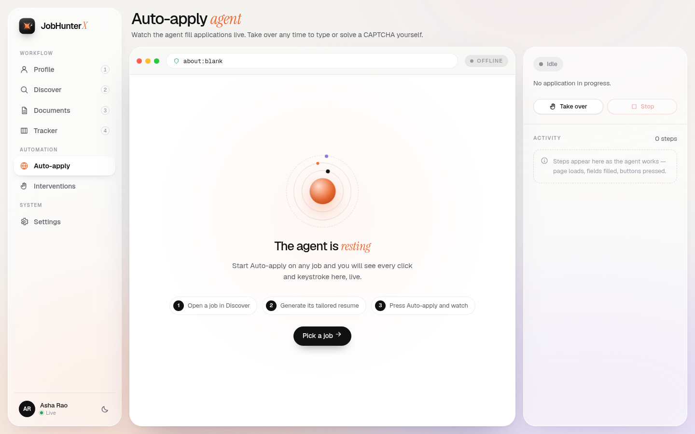
<br/><sub><i>No extra Chrome window — the browser is streamed into the app. Every step is listed in plain words, with what was clicked and typed.</i></sub>
<br/><br/>

#### 9 · When it needs you 🙌
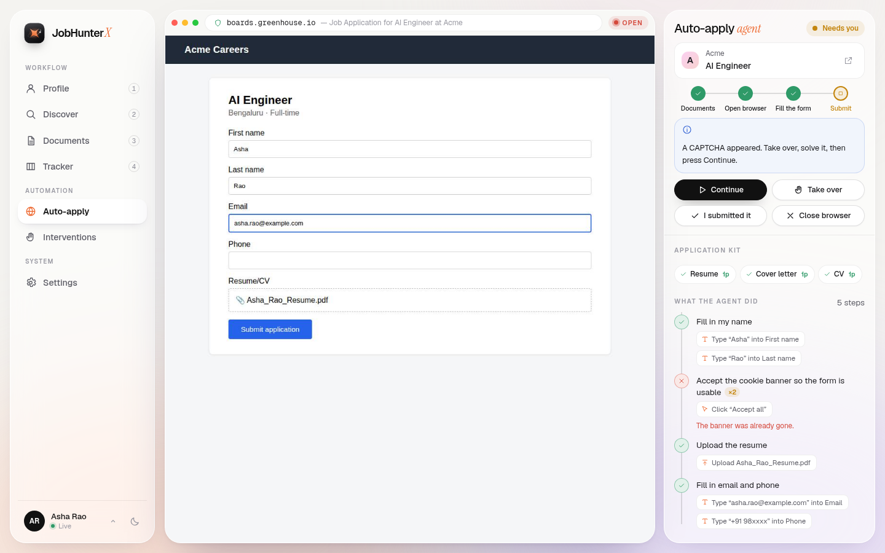
<br/><sub><i>CAPTCHA or login? Take over, click and type right in the view, then press Continue. Progress is saved, so nothing starts over.</i></sub>
<br/><br/>

#### 10 · Track everything 📊

<br/><sub><i>The whole journey in one stage bar, one-click "next stage", and the job beside the list — no sideways scrolling.</i></sub>
<br/><br/>

#### 11 · Your profile, your settings ⚙️

<br/><br/>
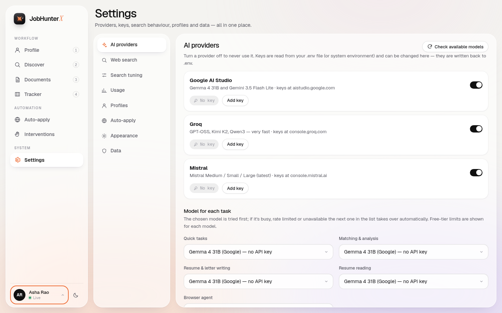
<br/><br/>
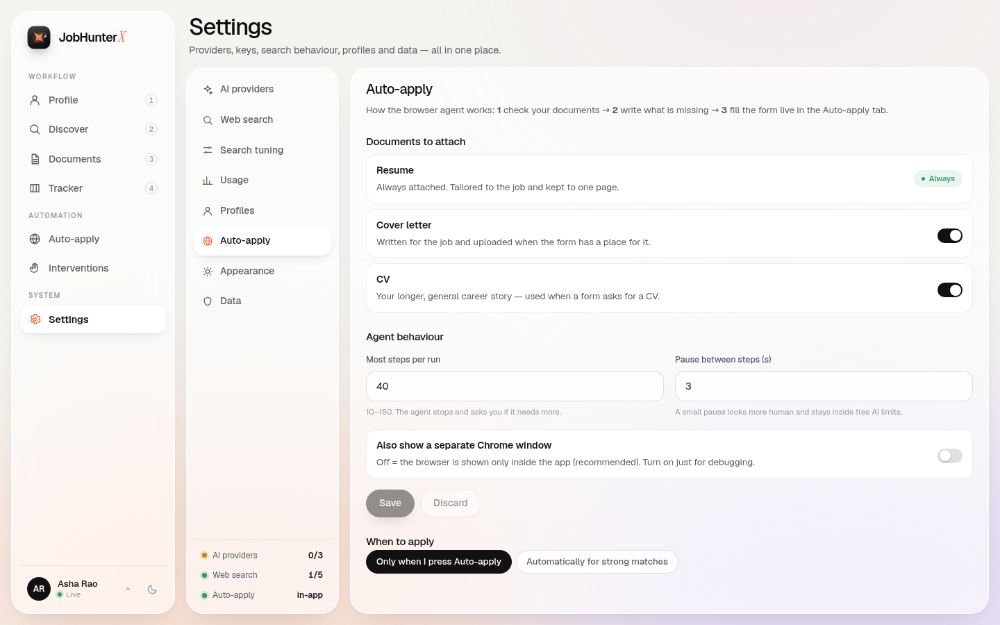
<br/><sub><i>Turn providers on/off, add keys (loaded from <code>.env</code>), pick a model per task, choose which documents Auto-apply attaches.</i></sub>
<br/><br/>

#### 12 · Dark mode & phones 🌙📱
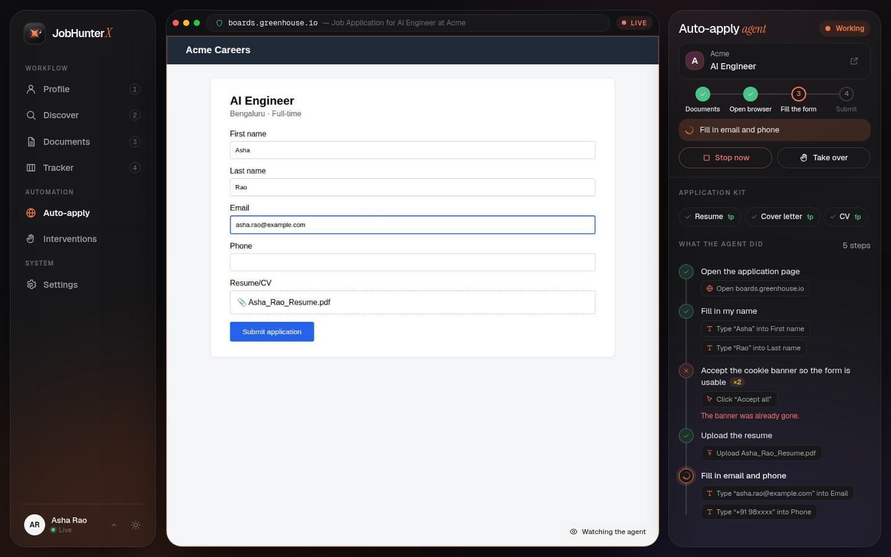
<br/><br/>

<br/><sub><i>One click for dark mode. On phones the sidebar becomes a floating bottom bar.</i></sub>

</div>

<br/>
<div align="center"></div>
<br/>

## 🤖 Auto-apply — the browser agent

Press **Auto-apply** on any job and three things happen, in this order:

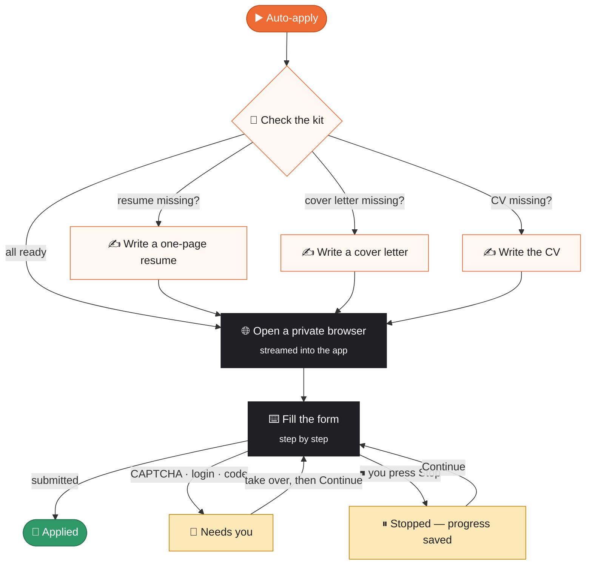
```mermaid
flowchart TD
    S(["▶️ Auto-apply"]) --> K{"📂 Check the kit"}
    K -->|"resume missing?"| R["✍️ Write a one-page resume"]
    K -->|"cover letter missing?"| L["✍️ Write a cover letter"]
    K -->|"CV missing?"| V["✍️ Write the CV"]
    K -->|"all ready"| O
    R --> O
    L --> O
    V --> O
    O["🌐 Open a private browser<br/><sub>streamed into the app</sub>"] --> F["⌨️ Fill the form<br/><sub>step by step</sub>"]
    F -->|"submitted"| A(["🎉 Applied"])
    F -->|"CAPTCHA · login · code"| N["🙌 Needs you"]
    F -->|"⏹ you press Stop"| X["⏸ Stopped — progress saved"]
    N -->|"take over, then Continue"| F
    X -->|"Continue"| F

    classDef go fill:#EE6B33,stroke:#c4501d,color:#fff;
    classDef kit fill:#fff7f2,stroke:#EE6B33,color:#1f1f24;
    classDef run fill:#1f1f24,stroke:#1f1f24,color:#fff;
    classDef wait fill:#fde9b8,stroke:#c4860f,color:#1f1f24;
    classDef ok fill:#2f9a68,stroke:#21754f,color:#fff;
    class S go; class K,R,L,V kit; class O,F run; class N,X wait; class A ok;
```

| Button | What it does |
|:--|:--|
| ⏹ **Stop now** | Stops **at once** (it does not wait for the current step). The browser stays open and every step is saved. |
| ✋ **Take over** | Pauses the agent. Your clicks, scrolling and typing go straight to the page in the live view. |
| ▶️ **Give back to agent** | The agent carries on from exactly where you left it. |
| ▶️ **Continue** | After a stop, a CAPTCHA or even an app restart: starts again **from the last page**, knowing what was already done. |
| ✅ **I submitted it** | You finished it yourself — the job is marked **Applied**. |
| ✖️ **Close browser** | Closes the private browser. Your steps stay saved. |

**Why it feels calm and clean** ✨

- 🪟 **No separate Chrome window.** The page is streamed with Chrome's own screencast into the Auto-apply tab. (Want a real window for debugging? Settings → Auto-apply → *Also show a separate Chrome window*.)
- 🧾 **Readable steps.** Each step shows the goal in plain words ("Fill in email and phone") with small chips for what was done ("Type … into Email", "Upload Asha_Rao_Resume.pdf"). Repeats are counted (×2) instead of listed again.
- 🧵 **One owner for the browser.** The agent, the live view and your clicks all run on one dedicated browser thread, so they never fight over the connection (this fixed the old *"navigation timed out"* and *"duplicate response"* errors).
- 💾 **Saved state.** Status, the kit, every step and the last page are stored in the database — reload the app, restart it, or switch tabs and pick up right where you were.
- 🐢 **Polite pacing.** A small pause between steps looks human and keeps you inside free AI limits (`BROWSER_STEP_DELAY_S`).

<details>
<summary><b>🛡️ Stealth & safety details</b></summary>
<br/>

- 🍪 Persistent private profile (`data/browser_profile`) so cookies build trust over time
- 🖥️ Normal desktop user-agent, automation flags hidden
- 🧹 Old/zombie Chrome processes and stale lock files are cleaned before each launch
- 🔐 Passwords and one-time codes are shown as `••••` in the step log
- 🔑 Optional email OTP reader for verification codes (`EMAIL_*` settings)

</details>

<br/>
<div align="center"></div>
<br/>

## 🧠 How matching works

JobHunterX does **not** just count shared keywords. It understands you, finds and checks real postings, reads each job,
and explains whether it genuinely fits.

<details>
<summary><b>🔍 The 9 stages of every search (click to open)</b></summary>
<br/>

| # | Stage | What happens | Where |
|---|-------|--------------|-------|
| 1 | **Understand** | The AI reads your profile into a validated structure: career tracks (with how close adjacent tracks are), realistic titles, skills with *evidence* (used at work / in projects / only listed), normalized locations. Years of experience are **computed from your dates** (overlaps merged, internships separate). Every AI claim is checked against your profile — invented skills are dropped. | `intelligence/candidate.py` |
| 2 | **Plan** | Diverse queries from your own titles and places, anchored on employers' own hiring systems (`site:` Greenhouse / Lever / Ashby / …). | `discovery/search.py` |
| 3 | **Discover** | Web search results are treated as *leads only*. Employer job boards found in results are expanded via their public APIs. | `discovery/search.py`, `discovery/ats.py` |
| 4 | **Normalize** | Every lead becomes one `JobPosting`: ATS API → schema.org JSON-LD → page text, in that order of trust. | `discovery/page.py` |
| 5 | **Dedupe** | Same job from many places is merged (ATS id, canonical URL, company+title+place, near-identical text); the first-party source wins and all sources are kept. | `discovery/dedupe.py` |
| 6 | **Validate** | Is it real, reachable, current, open? Per-field status: *verified / inferred / unverified / unknown / failed*. Unknown stays unknown. | `discovery/validate.py` |
| 7 | **Extract** | The AI reads the JD into a schema (required vs nice-to-have vs mandatory skills, experience, education, notice period, salary…). A skill is accepted only if it appears in the JD; experience/salary only with a verbatim quote that contains the number. Cached per JD. | `intelligence/job.py` |
| 8 | **Match** | Hard constraints first (career track, experience gap, seniority, location/work mode, mandatory skills, education, job open, notice, salary, excluded companies). **A failed hard constraint caps the score** — keyword overlap can never lift an incompatible job. Then weighted components (role, required/preferred skills by evidence strength, experience fit, responsibility overlap, seniority, location). | `intelligence/matching.py`, `intelligence/policy.py` |
| 9 | **Rank & explain** | Score 0–100, verdict (strong / good / stretch / weak / incompatible), strengths, gaps, unknowns and the exact reason a job was rejected. | UI: job drawer → "Why this score" |

> [!NOTE]
> **No hardcoded vocabularies.** There are no fixed lists of skills, job titles, cities or companies in the code.
> Knowledge comes from the AI (schema-validated and verified against the source text); the code only compares and checks.
> Scoring weights and tolerances live in one tunable place: `intelligence/policy.py` (override with `MATCH_POLICY_JSON`).

</details>

### Example: one candidate, five jobs

Candidate: ~1.5 years professional AI/ML experience, Hyderabad, not relocating.

| Job | Result | Why |
|-----|--------|-----|
| AI Engineer · 0–2 yrs · Python/LLM/RAG · Hyderabad | **Strong match** | Same track, experience fits, all required skills demonstrated |
| Senior AI Engineer · 6+ yrs · same skills | **Incompatible** | "Requires 6+ years; you have ~1.6" — identical skills do not help |
| Frontend Engineer · React/TypeScript | **Incompatible** | Different career track |
| AI Engineer · 1–3 yrs · Berlin on-site | **Incompatible** | Not one of your locations |
| AI Engineer · mandatory Kubernetes | **Incompatible** | "Mandatory: Kubernetes — not found in your profile" |

This exact scenario runs in the test suite (`tests/test_scenarios.py`).

## 📄 Resume vs CV vs cover letter

They are three different documents — JobHunterX makes all three, and Auto-apply checks for them before it starts.

| | 📄 **Resume** | 📚 **CV** | ✉️ **Cover letter** |
|---|---|---|---|
| For | One job | Your whole career | One job |
| Length | **One page** (text shrinks first, then the least relevant points are trimmed) | Kept to **one page when possible** (roomy layout first, then tighter) | Under 300 words |
| What's in it | The points that matter most for *this* job | Every role, project, education, certificates, achievements | Links your real experience to what the job asks for |
| Code | `generation/resume.py` | `generation/cv.py` | `generation/cover_letter.py` |

✅ **Nothing invented:** every AI-written line is fact-checked (`generation/evidence.py`). A new number, tool, employer
or claim that isn't in your profile is rejected and your own words are kept.

<br/>
<div align="center"></div>
<br/>

## 🤖 LLM Models & Provider Architecture

One router (`config/llm_router.py`) sends every AI call through a **task chain**: the first usable model answers, and the
next one takes over if it is busy, rate limited, turned off or not on your account. The model catalog, chains and free-tier
limits live in `config/models.py`.

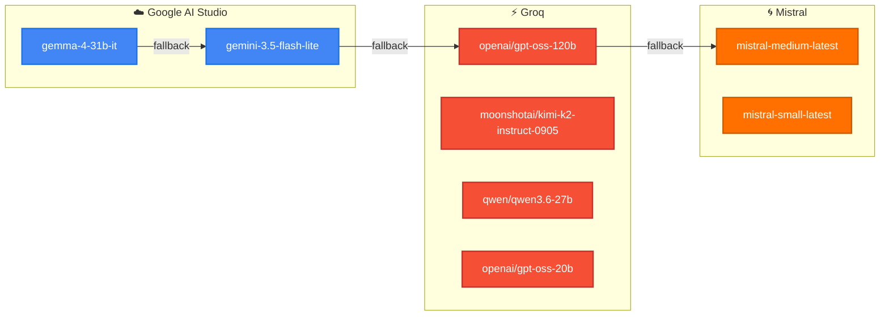
```mermaid
graph LR
    subgraph Google["☁️ Google AI Studio"]
        G1["gemma-4-31b-it"]
        G2["gemini-3.5-flash-lite"]
    end
    subgraph Groq["⚡ Groq"]
        GR1["openai/gpt-oss-120b"]
        GR2["moonshotai/kimi-k2-instruct-0905"]
        GR3["qwen/qwen3.6-27b"]
        GR4["openai/gpt-oss-20b"]
    end
    subgraph Mistral["🌀 Mistral"]
        M1["mistral-medium-latest"]
        M2["mistral-small-latest"]
    end
    G1 -->|fallback| G2 -->|fallback| GR1 -->|fallback| M1

    classDef google fill:#4285F4,stroke:#1a73e8,color:#fff,stroke-width:2px;
    classDef groq fill:#F55036,stroke:#c9302c,color:#fff,stroke-width:2px;
    classDef mistral fill:#FF7000,stroke:#cc5a00,color:#fff,stroke-width:2px;
    class G1,G2 google;
    class GR1,GR2,GR3,GR4 groq;
    class M1,M2 mistral;
```

### Task chains

| Task (Settings label) | Chain | Model order |
|:--|:--|:--|
| Quick tasks | `fast` | Gemma 4 31B → Gemini 3.5 Flash Lite → GPT-OSS 20B → Qwen3.6 27B / Qwen3 32B → Mistral Small |
| Matching & analysis | `reasoning` | Gemma 4 31B → Gemini 3.5 Flash Lite → GPT-OSS 120B → Kimi K2 → Mistral Medium |
| Resume & letter writing | `tailoring` | Gemma 4 31B → Gemini 3.5 Flash Lite → Kimi K2 → GPT-OSS 120B → Mistral Medium |
| Resume reading | `extraction` | Gemma 4 31B → Gemini 3.5 Flash Lite → GPT-OSS 120B → Qwen3.6 27B / Qwen3 32B → Mistral Medium |
| Browser agent | `browser` | Gemini 3.5 Flash Lite → GPT-OSS 120B → Mistral Small (→ Gemma 4 31B) |

Llama models are deliberately not used. In **Settings → AI providers** you can turn any provider off, add or replace its key,
pick the first model for each task, and press **Check available models** — the app asks each provider's `/models`
endpoint with your key and skips models your account cannot call.

### 💳 Free-tier limits the router respects

Each model gets its own limiter: requests are spaced to its **RPM**, a rolling one-minute window keeps it under **TPM**, and
daily **RPD / TPD** counters stop using it for the day once spent (the chain moves on). A 429 also puts the provider in a
short cooldown. Override any number with `MODEL_LIMITS_JSON` in `.env`, e.g.
`MODEL_LIMITS_JSON={"gemini/gemma-4-31b-it": {"rpm": 30, "rpd": 14400}}` — limits differ per account and change often.

| Provider | Model | RPM | Per day | TPM | Notes |
|:--|:--|:--|:--|:--|:--|
| Google AI Studio | `gemma-4-31b-it` | 15 | 1,500 req | — | Gemma runs on the Gemini API ([guide](https://ai.google.dev/gemma/docs/core/gemma_on_gemini_api)); no system role, so instructions are sent inline |
| Google AI Studio | `gemini-3.5-flash-lite` | 15 | 500 req | 250K | Fast; primary for the browser agent |
| Groq | `openai/gpt-oss-120b` | 30 | 1K req · 200K tok | 8K | Reasoning effort set to low |
| Groq | `moonshotai/kimi-k2-instruct-0905` | 60 | 1K req · 300K tok | 10K | Strong writing |
| Groq | `qwen/qwen3.6-27b` · `qwen/qwen3-32b` | 30 · 60 | 1K req | 8K · 6K | Reasoning trace hidden |
| Groq | `openai/gpt-oss-20b` | 30 | 1K req · 200K tok | 8K | Light and fast |
| Mistral | `mistral-medium-latest` | 50 | — | 25K | Free plan limits are per account (Admin console → Limits) |
| Mistral | `mistral-small-latest` | 50 | — | 50K | |
| Mistral | `mistral-large-latest` | 4 | — | 250K | Very low request rate on the free plan |

> [!NOTE]
> **Why you may see `500 INTERNAL` from Gemma:** Google occasionally returns a momentary internal error. The Gemma client
> (`config/gemma.py`) retries with exponential backoff and jitter; if it keeps failing, the chain moves to the next model.
> Resume upload runs in the background with live progress, so a slow free-tier call never times out the page.

<br/>
<div align="center"></div>
<br/>

## 🌐 Job Sources & Verification

| Source | Trust | How it is used |
|--------|-------|----------------|
| **Employer ATS APIs** — Greenhouse, Lever, Ashby, SmartRecruiters, Recruitee, Workable | First-party, **verified** | Structured postings; re-verified live by job id (a closed job disappears from the board / returns 404) |
| **schema.org JobPosting** on a page | Verified when the hiring organisation's site is the page's site; otherwise inferred | Title, company, location, dates, `validThrough`, remote eligibility, salary |
| **Other pages** (job boards, aggregators) | Unverified | Text only; if the page links to a supported ATS posting, that posting is used instead |
| **Web search** — TinyFish → Tavily → Exa → Brave → DuckDuckGo | Leads only | Never shown as jobs until resolved by one of the above |

Search providers are tried in priority order (primary first, DuckDuckGo last) with zero-spend protection
(`tools/zero_spend.py`) and a usage ledger. All fetching of untrusted URLs goes through an SSRF-safe client
(`discovery/net.py`: public addresses only, checked on every redirect, size and time limits).

<br/>
<div align="center"></div>
<br/>

## 🎨 Design: fonts & themes

| | |
|:--|:--|
| 🔤 **Fonts** | **Geist** for text, **Instrument Serif** for the warm accent word in each heading, **Geist Mono** for links and numbers — all bundled, no CDN |
| 🎨 **Colours** | Warm off-white canvas with a soft pastel wash, white cards, black pill buttons, one orange accent |
| 🌙 **Themes** | Light and dark, one click in the sidebar (or Settings → Appearance) |
| 🎞️ **Motion** | Orbit loader, resume "scan" beam, springy tabs, count-up numbers, self-drawing score rings, live step log. Settings → Appearance → Motion: *Full · Reduced · Follow system* |
| 🧭 **No long scrolling** | Every screen fits the window: list ⇄ detail, library ⇄ preview, nav ⇄ settings — panes scroll on their own |
| ♿ **Accessible** | Keyboard friendly, focus-trapped dialogs, live regions for progress and toasts |

<br/>
<div align="center"></div>
<br/>

## ⚡ Quickstart

### What you need

- 🐍 **Python 3.11+**
- 🔑 **One free AI key** — Google AI Studio is the easiest

### ① Get the code

```bash
git clone https://github.com/kvcops/jobhunterx.git
cd jobhunterx
python -m venv .venv
.venv\Scripts\activate          # Windows
source .venv/bin/activate       # Linux / macOS
```

### ② Install

```bash
pip install -r requirements.txt --prefer-binary
playwright install chromium     # the browser the agent uses
```

### ③ Add your keys

```bash
cp jobhunterx/.env.example jobhunterx/.env
```

```env
GOOGLE_API_KEY=your_google_ai_studio_key   # free — recommended
GROQ_API_KEY=your_groq_key                 # optional
MISTRAL_API_KEY=your_mistral_key           # optional
```

> [!TIP]
> **Free keys:** [Google AI Studio](https://aistudio.google.com/) · [Groq](https://console.groq.com/) · [Mistral](https://console.mistral.ai/).
> You can also paste keys later in **Settings** — they are saved to `.env` for you.

### ④ Start 🚀

```bash
cd jobhunterx
python -m jobhunterx.api.main
```

<div align="center">

### Open **[http://127.0.0.1:8000](http://127.0.0.1:8000)** and start hunting. 🎯

</div>

### ⚙️ Handy settings (`.env` or Settings page)

| Setting | Default | What it means |
|:--|:--|:--|
| `APPLY_WITH_COVER_LETTER` | `true` | Write and attach a cover letter when applying |
| `APPLY_WITH_CV` | `true` | Write and attach your CV when a form asks for one |
| `BROWSER_MAX_STEPS` | `40` | Most steps per Auto-apply run |
| `BROWSER_STEP_DELAY_S` | `3` | Pause between agent steps (seconds) |
| `BROWSER_SHOW_WINDOW` | `false` | Also open a real Chrome window (debugging only) |
| `MAX_JOBS_PER_SEARCH` | see `.env.example` | How many jobs one search analyses |
| `MODEL_LIMITS_JSON` | — | Override any model's free-tier limits |

<br/>
<div align="center"></div>
<br/>

## 📐 Architecture

```
jobhunterx/jobhunterx/
├── domain/          # 📦 Data contracts: profile, snapshot, job posting, match, document
├── intelligence/    # 🧠 Understanding + judgement (candidate, job, matching, policy)
├── discovery/       # 🔎 Search, ATS adapters, page parsing, dedupe, validation, SSRF-safe fetch
├── generation/      # 📝 Resume / CV / cover letter + fact-checking + one-page PDF rendering
├── services/        # 🧩 Orchestration: search runs, jobs, documents, profiles, auto-apply kit
├── agents/
│   ├── browser_agent.py   # 🤖 Auto-apply session: steps, stop / take over / continue / close
│   ├── browser_worker.py  # 🧵 One long-lived thread that owns the browser
│   └── live_view.py       # 📺 Chrome screencast → the app, your clicks → the page
├── storage.py       # 💾 SQLite: jobs, documents, people, search runs, apply sessions (+ migrations)
├── db_health.py     # 🩺 Check, repair and back up the database on every start
├── api/             # 🔌 FastAPI routes, WebSockets (/ws events, /ws/browser live view)
├── config/          # ⚙️ Settings, model catalog & limits, LLM router, app state
└── web/             # 🎨 Preact + htm UI with bundled fonts — no build step
```

* 🔁 **One search at a time**; every event carries its run id, so old results never leak into a new search.
* 💸 **Low AI cost:** profile understanding and job reading are cached, role-fit is batched, out-of-area jobs skip AI.
* 🔒 **Secure by default:** same-origin CORS, CSRF guard, WebSocket origin checks, SSRF-safe fetching, upload limits, autoescaped templates.

<br/>
<div align="center"></div>
<br/>

## 🔌 API Reference

The full contract (REST + WebSocket) is in [`jobhunterx/docs/API.md`](jobhunterx/docs/API.md).

| Group | Endpoints |
|-------|-----------|
| 👤 Profile | `GET/PUT /api/profile`, `POST /api/profile/upload`, people: `GET/POST /api/people`, `POST /api/people/{id}/activate` |
| 🔎 Searches | `POST /api/searches`, `GET /api/searches/current`, `GET /api/searches/{id}`, `POST /api/searches/{id}/cancel` |
| 💼 Jobs | `GET /api/jobs`, `GET /api/jobs/{id}`, `PUT/DELETE /api/jobs/{id}/saved`, `PATCH /api/jobs/{id}`, `POST /api/jobs/{id}/verify`, `POST /api/jobs/{id}/rescore` |
| 📝 Documents | `POST /api/jobs/{id}/documents`, `POST /api/documents/cv`, `GET /api/documents`, `GET /api/documents/{id}/pdf` |
| 🤖 Auto-apply | `POST /api/jobs/{id}/apply`, `GET /api/apply/current`, `POST /api/apply/{job_id}/stop · take-over · release · continue · close · done`, `WS /ws/browser` |
| ⚙️ System | settings, providers, models, usage, database health / repair / backup, interventions, reset |

<br/>
<div align="center"></div>
<br/>

## 🧪 Testing

```bash
cd jobhunterx
pip install pytest pytest-asyncio playwright
python -m pytest -q
```

* `tests/test_scenarios.py` — the full pipeline on a realistic candidate (fake network + fake AI, including made-up claims that must be rejected)
* `tests/test_api_v2.py` — API contract, errors, cancellation, CSRF / WebSocket / SSRF guards
* `tests/frontend/test_ui.py` — Playwright against the real app

<br/>

<div align="center">


<br/>
<br/>

## 📜 License

**MIT License** — Build on it, fork it, make it yours.

Built with ❤️ and an unhealthy amount of caffeine for job seekers who refuse to waste time on repetitive applications.

<br/>

### ⭐ Star this repo if JobHunterX saved you from the soul-crushing grind of manual job applications

<br/>

<a href="https://github.com/kvcops/jobhunterx/stargazers"></a>
<a href="https://github.com/kvcops/jobhunterx/fork"></a>
<a href="https://github.com/kvcops/jobhunterx/issues"></a>

<br/>
<br/>


</div>
