<div align="center">


<br/>


<p align="center">
  
</p>

<h3 align="center">🚀 AI career intelligence: understands your career, finds roles that genuinely fit, explains every match, and prepares honest application material</h3>

<br/>

<p align="center">
  <a href="https://python.org"></a>
  <a href="https://fastapi.tiangolo.com"></a>
  <a href="https://playwright.dev"></a>
</p>

<p align="center">
  <a href="https://ai.google.dev/"></a>
  <a href="https://groq.com"></a>
  <a href="https://mistral.ai"></a>
  
</p>

<p align="center">
  
  
  
  
</p>

<p align="center">
  
  
  
</p>

<br/>


<br/>

<table>
<tr><td align="center">

*Upload your resume. Pick a city. Go grab coffee.*
**JobHunterX** discovers jobs, scores them against your skills, tailors a pixel-perfect PDF resume for each one, opens a stealth Chrome browser, fills every form field, and applies — streaming every frame live to your dashboard so you can take over the keyboard whenever a CAPTCHA or login wall shows up.

### 💜 *It's the job-hunting wingman you always wished you had.* 💜

</td></tr>
</table>

<br/>

<a href="#-quickstart"></a>
<a href="#-how-it-works--career-intelligence-not-keyword-search"></a>
<a href="#-api-reference"></a>
<a href="#-testing"></a>

</div>

<br/>

<div align="center">

</div>

<br/>

<details open>
<summary><b>📚 Table of Contents</b></summary>
<br/>

- [🖥️ Dashboard Preview](#️-dashboard-preview)
- [✨ Browser Agent Preview](#-browser-agent-preview)
- [🧠 How It Works](#-how-it-works--career-intelligence-not-keyword-search)
- [🤖 LLM Models & Provider Architecture](#-llm-models--provider-architecture)
- [🌐 Job Sources & Verification](#-job-sources--verification)
- [🔄 Pipeline Modes](#-pipeline-modes-automatic-vs-manual)
- [🛡️ Human-in-the-Loop System](#️-human-in-the-loop-hitl-system)
- [📐 Architecture](#-architecture)
- [⚡ Quickstart](#-quickstart)
- [🔌 API Reference](#-api-reference)
- [🧪 Testing](#-testing)
- [🛡️ Stealth Browser Architecture](#️-stealth-browser-architecture)
- [📜 License](#-license)

</details>

<br/>

## 🖥️ Dashboard Preview

A calm, light-first **app-style** interface: warm off-white canvas with a soft pastel wash, white cards, a floating
sidebar, black pill actions, one warm orange accent and an elegant serif accent word in each heading.
Every screen fits the window — lists, details and editors scroll inside their own panes, so you never scroll a long page.
Dark theme is one click away.

<div align="center">
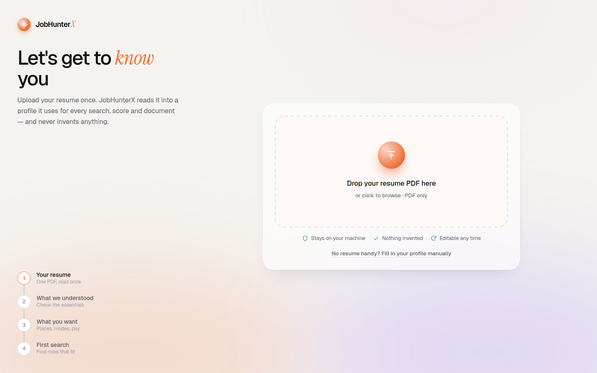
<br/><sub><i>First run — a one-time, 4-step setup: upload your resume → check what was understood → set preferences → first search</i></sub>
<br/><br/>
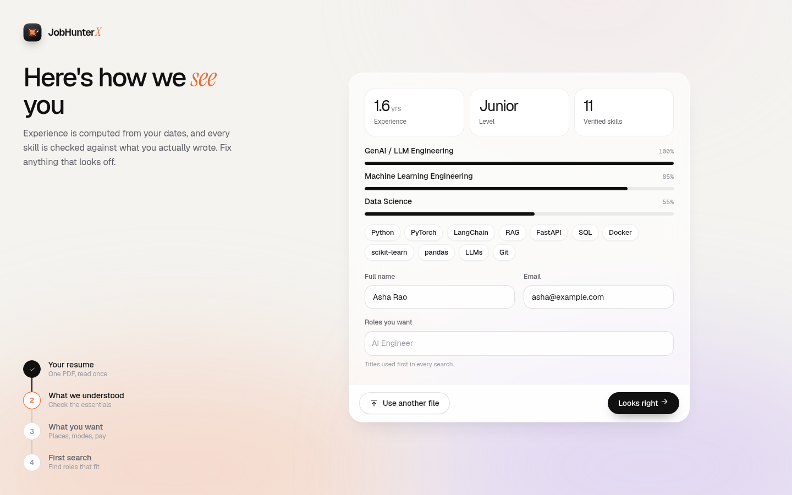
<br/><sub><i>"Here's how we see you" — computed experience, level, career tracks and verified skills, editable before you continue</i></sub>
<br/><br/>
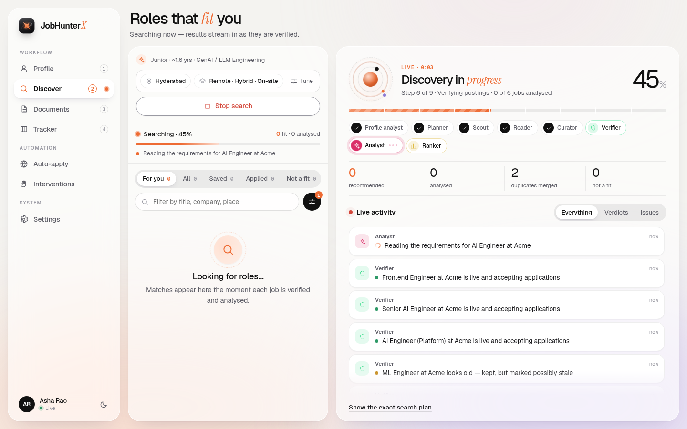
<br/><sub><i>Discover — search and ranked results on the left, live mission control (9-stage pipeline, counters) on the right</i></sub>
<br/><br/>
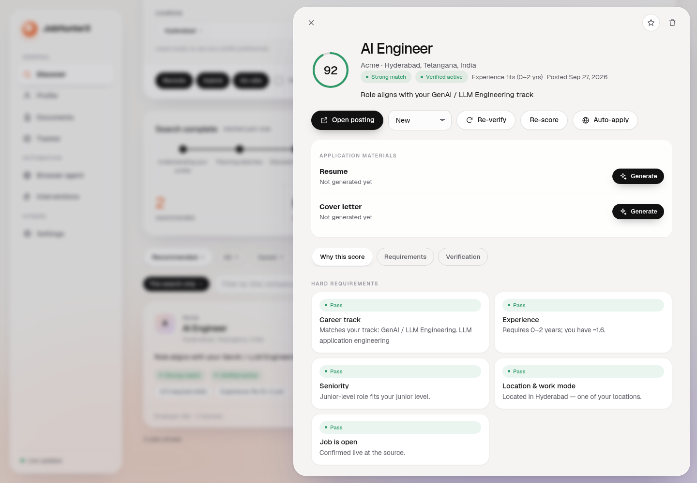
<br/><sub><i>Select a job and it opens beside the list — hard requirements, weighted score, requirements, verification and the application kit</i></sub>
<br/><br/>
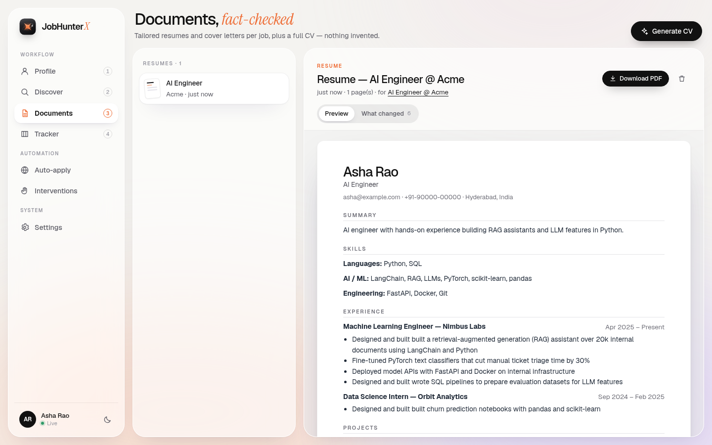
<br/><sub><i>Documents — library on the left, live preview on the right, plus "What changed": every AI edit accepted or rejected by the fact-checker</i></sub>
<br/><br/>
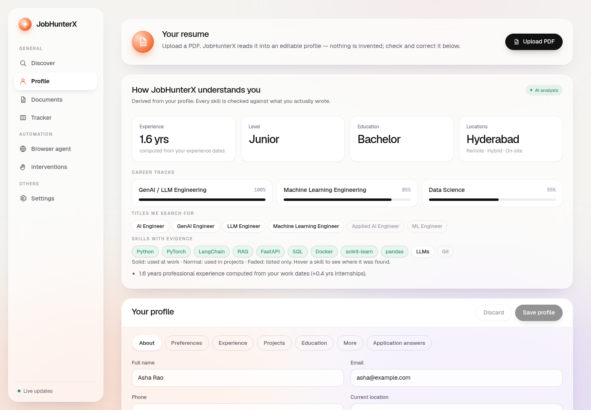
<br/><sub><i>Profile — understanding on the left, a tabbed editor on the right</i></sub>
<br/><br/>
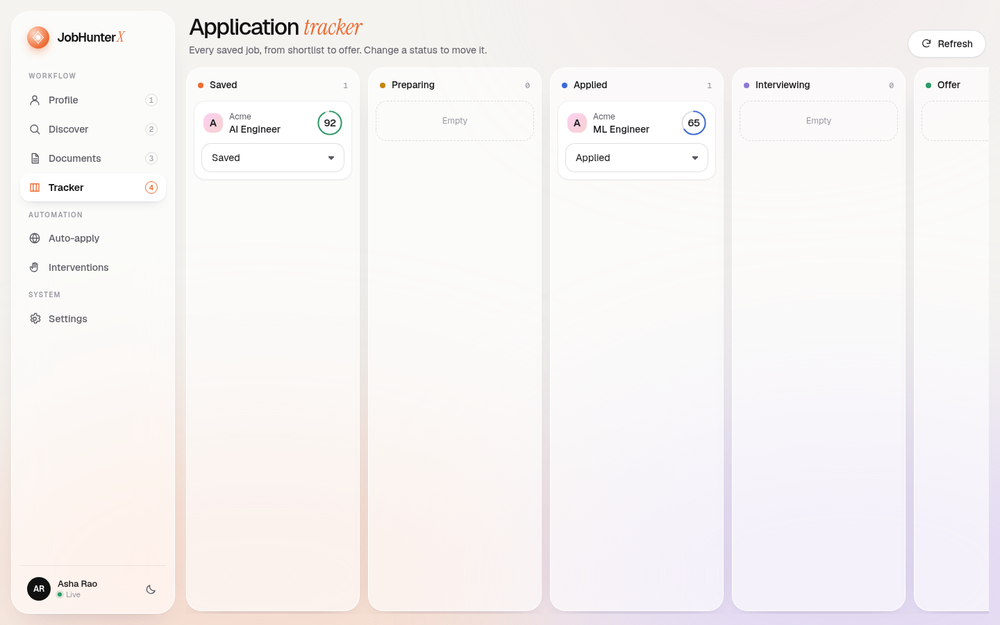
<br/><sub><i>Tracker — a horizontal board from Saved to Offer; change a status to move a card</i></sub>
<br/><br/>
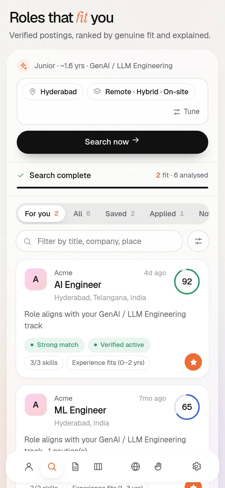
<br/><sub><i>Fully responsive — on phones the sidebar becomes a floating bottom bar</i></sub>
</div>

### UI highlights

| | |
|---|---|
| **Flow** | Lifecycle-driven: boot splash → one-time onboarding (resumes where you left off after a reload) → app. Sidebar is ordered like the work: Profile → Discover → Documents → Tracker |
| **No long scrolling** | Split workspaces (list ⇄ detail, library ⇄ preview, nav ⇄ settings); options live in popovers, sections in tabs |
| **Motion** | Signature orbit loader for live search, resume "scan" animation while reading, springy sliding tab and sidebar indicators, count-up numbers, self-drawing score rings, staggered list entrances, glow on freshly streamed jobs, shimmer skeletons, page transitions via the View Transitions API (with CSS fallback) |
| **Design system** | Quiet white cards on a warm canvas, a single orange accent, bundled fonts (Geist · Instrument Serif · Geist Mono — no CDN at runtime), light + dark themes, full `prefers-reduced-motion` support |
| **Explainable cards** | Thin score ring coloured by verdict, verification badge, skills matched x/y, experience fit, source and freshness |
| **Reliable state** | One central store with an explicit app phase; results from an old search can never leak into a new one; late responses are ignored; failed saves roll back |
| **Accessible** | Keyboard navigation (arrow keys in tabs, Esc closes details, popovers and dialogs), focus-trapped dialogs, ARIA live regions for progress and toasts |

<br/>
<div align="center"></div>
<br/>

## ✨ Browser Agent Preview

<div align="center">
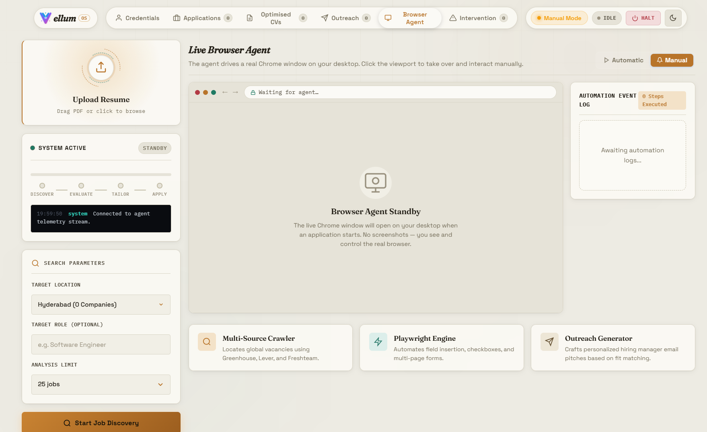
<br/>
<sub><i>Live browser canvas streaming, and real-time agent activity feed</i></sub>
</div>

<br/>
<div align="center"></div>
<br/>

## 🧠 How It Works — Career Intelligence, Not Keyword Search

JobHunterX does not search for "Python + AI" and rank pages by how many keywords they share.
It **understands the candidate**, **finds and verifies real postings**, **reads each job**, and
**explains** whether it genuinely fits — then prepares honest, job-specific application material.

Every search run shows these stages live in the UI:

| # | Stage | What happens | Where |
|---|-------|--------------|-------|
| 1 | **Understand** | The AI reads your profile into a validated structure: career tracks (with how close adjacent tracks are), realistic titles, skills with *evidence* (used at work / in projects / only listed), normalized locations. Years of experience are **computed from your dates** (overlaps merged, internships separate). Every AI claim is checked against your profile — invented skills are dropped. | `intelligence/candidate.py` |
| 2 | **Plan** | Diverse queries from your own titles and places, anchored on employers' own hiring systems (`site:` Greenhouse / Lever / Ashby / …). | `discovery/search.py` |
| 3 | **Discover** | Web search results are treated as *leads only*. Employer job boards found in results are expanded via their public APIs. | `discovery/search.py`, `discovery/ats.py` |
| 4 | **Normalize** | Every lead becomes one `JobPosting`: ATS API → schema.org JSON-LD → page text, in that order of trust. | `discovery/page.py` |
| 5 | **Dedupe** | Same job from many places is merged (ATS id, canonical URL, company+title+place, near-identical text); the first-party source wins and all sources are kept. | `discovery/dedupe.py` |
| 6 | **Validate** | Is it real, reachable, current, open? Per-field status: *verified / inferred / unverified / unknown / failed*. Unknown stays unknown. | `discovery/validate.py` |
| 7 | **Extract** | The AI reads the JD into a schema (required vs nice-to-have vs mandatory skills, experience, education, notice period, salary…). A skill is accepted only if it appears in the JD; experience/salary only with a verbatim quote that contains the number. Cached per JD. | `intelligence/job.py` |
| 8 | **Match** | Hard constraints first (career track, experience gap, seniority, location/work mode, mandatory skills, education, job open, notice, salary, excluded companies). **A failed hard constraint caps the score** — keyword overlap can never lift an incompatible job. Then weighted components (role, required/preferred skills by evidence strength, experience fit, responsibility overlap, seniority, location). | `intelligence/matching.py`, `intelligence/policy.py` |
| 9 | **Rank & explain** | Score 0–100, verdict (strong / good / stretch / weak / incompatible), strengths, gaps, unknowns and the exact reason a job was rejected. | UI: job drawer → "Why this score" |

> [!NOTE]
> **No hardcoded vocabularies.** There are no fixed lists of skills, job titles, cities or companies in the code.
> Knowledge comes from the AI (schema-validated and verified against the source text); the code only compares and checks.
> Scoring weights and tolerances live in one tunable place: `intelligence/policy.py` (override with `MATCH_POLICY_JSON`).

### Example: one candidate, five jobs

Candidate: ~1.5 years professional AI/ML experience, Hyderabad, not relocating.

| Job | Result | Why |
|-----|--------|-----|
| AI Engineer · 0–2 yrs · Python/LLM/RAG · Hyderabad | **Strong match** | Same track, experience fits, all required skills demonstrated |
| Senior AI Engineer · 6+ yrs · same skills | **Incompatible** | "Requires 6+ years; you have ~1.6" — identical skills do not help |
| Frontend Engineer · React/TypeScript | **Incompatible** | Different career track |
| AI Engineer · 1–3 yrs · Berlin on-site | **Incompatible** | Not one of your locations |
| AI Engineer · mandatory Kubernetes | **Incompatible** | "Mandatory: Kubernetes — not found in your profile" |

This exact scenario runs in the test suite (`tests/test_scenarios.py`).

### Resume vs CV vs cover letter — three different documents

| | **Resume** | **CV** | **Cover letter** |
|---|---|---|---|
| Scope | One job | Whole career | One job |
| Length | One page (typography shrinks, then least-relevant items are trimmed) | Multi-page | < 300 words |
| Content | Most relevant bullets/projects for *this* JD, rewritten to foreground what it asks for | Every role with all bullets, every project with links and tech, education, certifications, achievements, competitions, languages | Ties your real evidence to the job's requirements; does not claim gaps |
| Code | `generation/resume.py` | `generation/cv.py` | `generation/cover_letter.py` |

**Evidence-based:** every AI-written line is fact-checked (`generation/evidence.py`). A rewrite that adds a number,
tool, employer or claim that is not in your profile — or attaches a job keyword to an experience that never mentioned it —
is rejected and your original text is kept. The Documents view shows each change (accepted or rejected, and why).

<br/>
<div align="center"></div>
<br/>

## 🤖 LLM Models & Provider Architecture

JobHunterX uses a **multi-provider LLM router** (`llm_router.py`) with automatic failover, per-provider rate limiting, disk caching, and concurrency semaphores. Here's every model in the system:

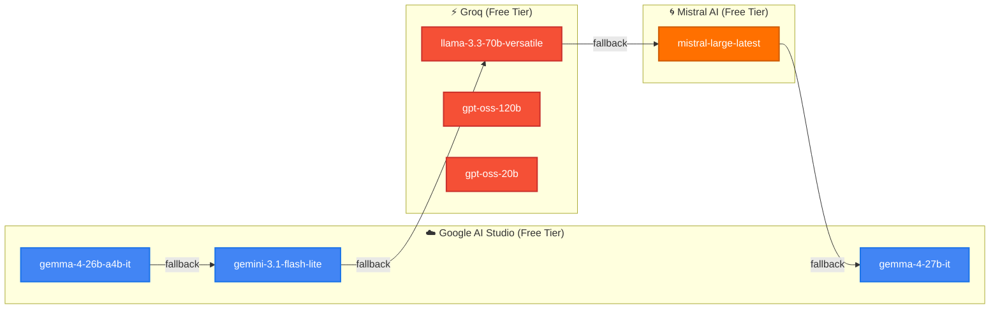
```mermaid
graph LR
    subgraph Google["☁️ Google AI Studio (Free Tier)"]
        G1["gemma-4-26b-a4b-it"]
        G2["gemini-3.1-flash-lite"]
        G3["gemma-4-27b-it"]
    end

    subgraph Groq["⚡ Groq (Free Tier)"]
        GR1["llama-3.3-70b-versatile"]
        GR2["gpt-oss-120b"]
        GR3["gpt-oss-20b"]
    end

    subgraph Mistral["🌀 Mistral AI (Free Tier)"]
        M1["mistral-large-latest"]
    end

    G1 -->|fallback| G2
    G2 -->|fallback| GR1
    GR1 -->|fallback| M1
    M1 -->|fallback| G3

    classDef google fill:#4285F4,stroke:#1a73e8,color:#fff,stroke-width:2px;
    classDef groq fill:#F55036,stroke:#c9302c,color:#fff,stroke-width:2px;
    classDef mistral fill:#FF7000,stroke:#cc5a00,color:#fff,stroke-width:2px;

    class G1,G2,G3 google;
    class GR1,GR2,GR3 groq;
    class M1 mistral;
```

### Fallback Chains by Task

| Chain Name | Purpose | Model Sequence |
|:-----------|:--------|:---------------|
| `fast` | Quick operations (search planning, scoring) | Gemma 4 26B → Gemini 3.1 Flash Lite |
| `reasoning` | Deep analysis (validation, match evaluation) | Gemma 4 26B → Gemini 3.1 Flash Lite |
| `tailoring` | Resume rewriting & bullet transforms | Gemma 4 26B → Gemini 3.1 Flash Lite |
| `extraction` | PDF resume parsing & profile construction | Gemma 4 26B → Gemini 3.1 Flash Lite |
| `browser` | Browser agent form-filling decisions | Gemini 3.1 Flash Lite |
| Browser fallback | When primary browser LLM fails | Llama 3.3 70B (Groq) → Mistral Large → Gemma 4 27B |

<br/>

### 💳 Rate Limiting & Budget Control

<details open>
<summary><b>🟢 Google AI Studio (Free Tier)</b></summary>
<br/>

| Model ID | RPM Limit | Min Delay | TPM Limit | RPD Limit (Requests Per Day) |
|:---------|:----------|:----------|:----------|:-----------------------------|
| **Gemma 4 26B** (`gemma-4-26b-a4b-it`) | 30 RPM | 2.0s | 16K TPM | **14,400 RPD** (14.4K req/day) |
| **Gemini 3.1 Flash Lite** (`gemini-3.1-flash-lite`) | 15 RPM | 4.0s | 250K TPM | **500 RPD** (500 req/day) |

</details>

<details>
<summary><b>⚡ Groq Cloud (Free Tier)</b></summary>
<br/>

| Model ID | RPM | RPD (Requests/Day) | TPM | TPD (Tokens/Day) |
|:---------|:----|:-------------------|:----|:-----------------|
| `llama-3.1-8b-instant` | 30 RPM | **14.4K RPD** | 6K TPM | 500K TPD |
| `llama-3.3-70b-versatile` | 30 RPM | **1K RPD** | 12K TPM | 100K TPD |
| `openai/gpt-oss-120b` | 30 RPM | **1K RPD** | 8K TPM | 200K TPD |
| `openai/gpt-oss-20b` | 30 RPM | **1K RPD** | 8K TPM | 200K TPD |
| `qwen/qwen3.6-27b` | 30 RPM | **1K RPD** | 8K TPM | 200K TPD |
| `meta-llama/llama-prompt-guard-2-22m/86m` | 30 RPM | **14.4K RPD** | 15K TPM | 500K TPD |

</details>

<details>
<summary><b>🌀 Mistral AI (Updated August 2026)</b></summary>
<br/>

| Model ID | RPS Limit | Approx RPM | TPM Limit | Category / Purpose |
|:---------|:----------|:-----------|:----------|:-------------------|
| `codestral-2508` | 2.08 RPS | ~125 RPM | 625K TPM | Code Generation & Agent Tooling |
| `codestral-embed` | 1.00 RPS | 60 RPM | 50K TPM | Code Embeddings |
| `devstral-2512` | 0.83 RPS | ~50 RPM | 1M TPM | Developer Agent Tasks |
| `labs-leanstral-1-5-1` | 0.63 RPS | ~38 RPM | 5M TPM | Experimental / High Throughput |
| `ministral-14b-2512` | 0.50 RPS | 30 RPM | 937.5K TPM | Edge / Fast Reasoning |
| `ministral-3b-2512` | 12.50 RPS | 750 RPM | 1.3M TPM | Ultra-fast Micro Decisions |
| `ministral-8b-2512` | 3.13 RPS | ~188 RPM | 625K TPM | High-Speed Lightweight Agent |
| `mistral-embed-2312` | 1.00 RPS | 60 RPM | 20M TPM | Text Embeddings |
| `mistral-large-2512` | 0.07 RPS | ~4 RPM | 250K TPM | Heavy Reasoning Fallback |
| `mistral-medium-2505` | 0.42 RPS | ~25 RPM | 375K TPM | Mid-tier Reasoning |
| `mistral-medium-2508` | 0.38 RPS | ~23 RPM | 356.25K TPM | Mid-tier Reasoning |
| `mistral-medium-latest` | 0.83 RPS | ~50 RPM | 25K TPM | General Tasks |
| `mistral-moderation-2603` | 1.67 RPS | ~100 RPM | 50K TPM | Content Moderation Guard |
| `mistral-small-2603` | 0.83 RPS | ~50 RPM | 50K TPM | Fast General Fallback |

</details>

<br/>

> [!NOTE]
> **Gemma Budget System** (`gemma.py`): Enforces a hard daily cap of **14,400 requests/day** (14.4K RPD) and 30 RPM on `gemma-4-26b-a4b-it` to stay strictly within Google AI Studio's free tier. State is tracked in-memory. When the budget is exhausted, the other models in each chain take over; if no model is available, analysis falls back to the candidate's own data and is clearly marked as partial in the UI.

<br/>
<div align="center"></div>
<br/>

## 🌐 Job Sources & Verification

| Source | Trust | How it is used |
|--------|-------|----------------|
| **Employer ATS APIs** — Greenhouse, Lever, Ashby, SmartRecruiters, Recruitee, Workable | First-party, **verified** | Structured postings; re-verified live by job id (a closed job disappears from the board / returns 404) |
| **schema.org JobPosting** on a page | Verified when the hiring organisation's site is the page's site; otherwise inferred | Title, company, location, dates, `validThrough`, remote eligibility, salary |
| **Other pages** (job boards, aggregators) | Unverified | Text only; if the page links to a supported ATS posting, that posting is used instead |
| **Web search** — TinyFish → Tavily → Exa → Brave → DuckDuckGo | Leads only | Never shown as jobs until resolved by one of the above |

Search providers are tried in priority order (primary first, DuckDuckGo last) with zero-spend protection
(`tools/zero_spend.py`) and a usage ledger. All fetching of untrusted URLs goes through an SSRF-safe client
(`discovery/net.py`: public addresses only, checked on every redirect, size and time limits).

<br/>
<div align="center"></div>
<br/>

## 🔄 Pipeline Modes: Automatic vs. Manual

JobHunterX runs in two modes, switchable at any time from the dashboard or via the `/api/pipeline-mode` endpoint.

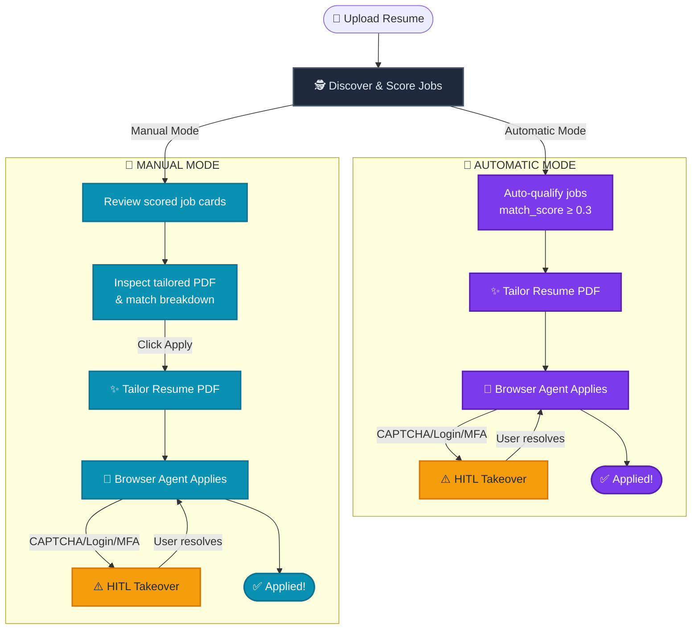
```mermaid
flowchart TD
    START([📄 Upload Resume]) --> DISCOVER
    DISCOVER["🕵️ Discover & Score Jobs"]

    DISCOVER -->|Automatic Mode| AUTO_PIPE
    DISCOVER -->|Manual Mode| MANUAL_PIPE

    subgraph AUTO ["🤖 AUTOMATIC MODE"]
        AUTO_PIPE["Auto-qualify jobs<br/>match_score ≥ 0.3"]
        AUTO_PIPE --> TAILOR_A["✨ Tailor Resume PDF"]
        TAILOR_A --> BROWSER_A["🥷 Browser Agent Applies"]
        BROWSER_A -->|CAPTCHA/Login/MFA| HITL_A["⚠️ HITL Takeover"]
        HITL_A -->|User resolves| BROWSER_A
        BROWSER_A --> DONE_A(["✅ Applied!"])
    end

    subgraph MANUAL ["👤 MANUAL MODE"]
        MANUAL_PIPE["Review scored job cards"]
        MANUAL_PIPE --> REVIEW["Inspect tailored PDF<br/>& match breakdown"]
        REVIEW -->|Click Apply| TAILOR_M["✨ Tailor Resume PDF"]
        TAILOR_M --> BROWSER_M["🥷 Browser Agent Applies"]
        BROWSER_M -->|CAPTCHA/Login/MFA| HITL_M["⚠️ HITL Takeover"]
        HITL_M -->|User resolves| BROWSER_M
        BROWSER_M --> DONE_M(["✅ Applied!"])
    end

    classDef auto fill:#7c3aed,stroke:#5b21b6,color:#fff,stroke-width:2px;
    classDef manual fill:#0891b2,stroke:#0e7490,color:#fff,stroke-width:2px;
    classDef shared fill:#1e293b,stroke:#475569,color:#e2e8f0,stroke-width:2px;
    classDef hitl fill:#f59e0b,stroke:#d97706,color:#1e293b,stroke-width:2px;

    class DISCOVER shared;
    class AUTO_PIPE,TAILOR_A,BROWSER_A,DONE_A auto;
    class MANUAL_PIPE,REVIEW,TAILOR_M,BROWSER_M,DONE_M manual;
    class HITL_A,HITL_M hitl;
```

| Feature | 🤖 Automatic Mode | 👤 Manual Mode |
|:--------|:------------------|:---------------|
| **Discovery & Scoring** | Runs automatically across all tracked companies | Same — runs automatically |
| **Application Trigger** | Jobs with `match_score ≥ 0.3` are auto-queued for apply | You review each job card and click **"Apply"** |
| **Resume Tailoring** | Happens automatically before browser launch | Happens when you trigger apply |
| **Browser Automation** | Launches immediately after tailoring | Launches only after your explicit click |
| **HITL Takeover** | Agent pauses & alerts you on login/CAPTCHA/MFA | Same behavior |
| **Best For** | Overnight autonomous job hunting | Careful, selective applications |

<br/>
<div align="center"></div>
<br/>

## 🛡️ Human-in-the-Loop (HITL) System

The browser agent doesn't panic when it hits a wall. It **gracefully pauses**, saves session state, captures a screenshot, and broadcasts an intervention event to your dashboard.

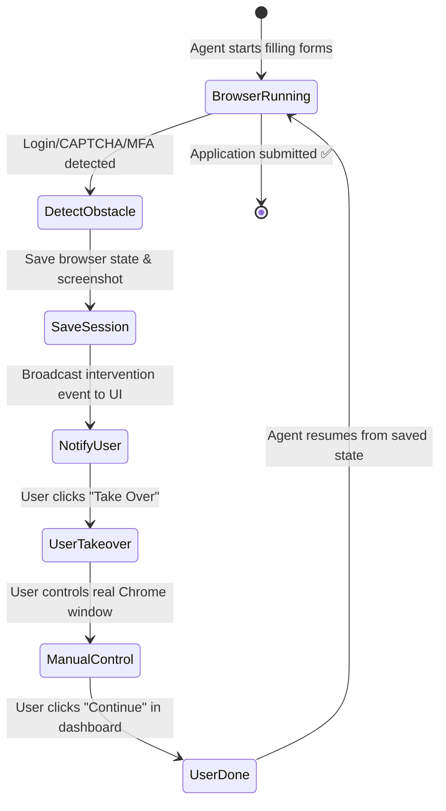
```mermaid
stateDiagram-v2
    [*] --> BrowserRunning: Agent starts filling forms
    BrowserRunning --> DetectObstacle: Login/CAPTCHA/MFA detected

    DetectObstacle --> SaveSession: Save browser state & screenshot
    SaveSession --> NotifyUser: Broadcast intervention event to UI
    NotifyUser --> UserTakeover: User clicks "Take Over"

    UserTakeover --> ManualControl: User controls real Chrome window
    ManualControl --> UserDone: User clicks "Continue" in dashboard

    UserDone --> BrowserRunning: Agent resumes from saved state
    BrowserRunning --> [*]: Application submitted ✅
```

| HITL Type | Trigger Condition | What Happens |
|:----------|:------------------|:-------------|
| 🔐 `LOGIN` | Sign-in / password prompts detected | Browser pauses, Chrome window stays open for manual login |
| 🤖 `CAPTCHA` | reCAPTCHA / hCaptcha / Turnstile detected | Screenshot captured, user solves in live Chrome window |
| 📱 `MFA` | OTP / 2FA / authenticator prompt | Agent waits for user to enter verification code |
| 📝 `MANUAL_FORM` | Complex custom form fields | User fills tricky fields, agent handles the rest |
| ⚠️ `TOO_COMPLEX` | Unsupported multi-page portal | Session saved, user can complete manually |

<br/>
<div align="center"></div>
<br/>

## 📐 Architecture

```
jobhunterx/jobhunterx/
├── domain/          # First-class data contracts: CandidateProfile/Snapshot, JobPosting, MatchAssessment, GeneratedDocument
├── intelligence/    # Understanding + judgement
│   ├── llm_structured.py   # schema-validated LLM calls, repair, caching, untrusted-text fencing
│   ├── candidate.py        # Stage 1: profile → snapshot (verified against the profile)
│   ├── job.py              # Stage 7: JD understanding (verified against the JD) + batched role-fit
│   ├── matching.py         # Stages 8–9: hard constraints, weighted components, explanations
│   ├── policy.py           # all scoring weights / tolerances (tunable)
│   └── text.py             # generic date/term helpers
├── discovery/       # Stages 2–7: search, ATS adapters, page parsing, dedupe, validation, SSRF-safe fetch
├── generation/      # Resume / CV / cover letter + fact-checking + PDF rendering (templates/)
├── services/        # Orchestration: search runs, jobs, documents, profile, browser apply
├── storage.py       # Persistence for the domain (extends the SQLite schema with migrations)
├── api/             # FastAPI routes (docs/API.md), WebSocket, browser live-stream
├── agents/          # PDF → profile extractor, browser auto-apply agent (browser-use)
├── config/          # settings, LLM router (model chains), Gemma budget, logging, legacy DB helpers
└── web/             # "Calm" UI: Preact + htm + bundled fonts (vendored, no build step)
```

* **One active search run**; starting another cancels it. Every job and WebSocket event carries the run id, so the
  UI never mixes results from an old run into a new one.
* **LLM cost control:** candidate understanding is cached per profile version, JD extraction per JD content hash,
  role-fit is batched, out-of-location jobs skip AI analysis entirely, and the number of AI extractions per search is capped.
* **Security:** CORS limited to the app's own origin, cross-site writes rejected (CSRF guard), WebSocket origin checks,
  SSRF-safe fetching, upload type/size limits, Jinja autoescaping, no `innerHTML` in the UI, untrusted job text fenced in prompts.

<br/>
<div align="center"></div>
<br/>

## ⚡ Quickstart

### Prerequisites

- **Python 3.11+**
- **At least one LLM API key** (Google AI Studio recommended — it's free)

<br/>

### ① Clone & Setup

```bash
git clone https://github.com/kvcops/jobhunterx.git
cd jobhunterx

# Create virtual environment
python -m venv .venv

# Activate (choose your OS)
.venv\Scripts\activate          # Windows PowerShell
source .venv/bin/activate       # Linux / macOS
```

### ② Install Dependencies

```bash
pip install -r requirements.txt --prefer-binary
playwright install chromium
```

> [!TIP]
> `--prefer-binary` tells pip to pick the newest release that ships a prebuilt wheel instead of compiling from source. The flag is also baked into `requirements.txt`, so `pip install -r requirements.txt` alone already avoids the issue.

### ③ Configure Environment

```bash
cp jobhunterx/.env.example jobhunterx/.env
```

Edit `jobhunterx/.env` with your API keys:

```env
# At minimum, set one of these (Google recommended for free tier):
GOOGLE_API_KEY=your_google_ai_studio_key
GROQ_API_KEY=your_groq_key           # Optional
MISTRAL_API_KEY=your_mistral_key     # Optional

# Application settings
BROWSER_USE_HEADLESS=true
HOST=127.0.0.1
PORT=8000
LOG_LEVEL=INFO
```

> [!TIP]
> **Getting API keys (all free):**
> - **Google AI Studio**: [aistudio.google.com](https://aistudio.google.com/) — Create key → Use Gemma 4 & Gemini 3.1 Flash Lite
> - **Groq**: [console.groq.com](https://console.groq.com/) — Free tier with Llama 3.3 70B
> - **Mistral**: [console.mistral.ai](https://console.mistral.ai/) — Free tier with Mistral Large

### ④ Launch 🚀

```bash
cd jobhunterx
python -m jobhunterx.api.main
```

<div align="center">

### Open **[http://127.0.0.1:8000](http://127.0.0.1:8000)** and start hunting. 🎯

</div>

<br/>
<div align="center"></div>
<br/>

## 🔌 API Reference

The full v2 contract (REST + WebSocket, request/response shapes, error format) is in
[`jobhunterx/docs/API.md`](jobhunterx/docs/API.md). Main groups:

| Group | Endpoints |
|-------|-----------|
| Profile | `GET/PUT /api/profile`, `POST /api/profile/upload` |
| Searches | `POST /api/searches`, `GET /api/searches/current`, `GET /api/searches/{id}`, `POST /api/searches/{id}/cancel` |
| Jobs | `GET /api/jobs?view=recommended\|all\|rejected\|saved\|applied`, `GET /api/jobs/{id}`, `PUT/DELETE /api/jobs/{id}/saved`, `PATCH /api/jobs/{id}`, `POST /api/jobs/{id}/verify`, `POST /api/jobs/{id}/rescore`, `POST /api/jobs/{id}/apply` |
| Documents | `POST /api/jobs/{id}/documents` (resume / cover letter), `POST /api/documents/cv`, `GET /api/documents`, `GET /api/documents/{id}`, `GET /api/documents/{id}/pdf` |
| System | settings, models, usage, pipeline mode, interventions, browser control, reset |

## 🧪 Testing

```bash
cd jobhunterx
pip install pytest pytest-asyncio playwright
python -m pytest -q                 # unit, scenario, API and browser tests
```

* `tests/test_scenarios.py` — the full pipeline on a realistic candidate and good/bad jobs (fake network + fake LLM,
  including deliberate LLM hallucinations that must be rejected).
* `tests/test_api_v2.py` — API contract, error envelope, idempotency, cancellation, CSRF/WebSocket/SSRF guards.
* `tests/frontend/test_ui.py` — Playwright against the real app: stale-run events, out-of-order responses,
  save rollback, document/job association, retry, XSS, mobile layout.

<br/>
<div align="center"></div>
<br/>

## 🛡️ Stealth Browser Architecture

The browser agent doesn't show up on radar:

- 🍪 **Persistent Chrome Profile** — Cookies, localStorage, and browsing history accumulate across sessions, building trust with Cloudflare and similar WAFs
- 🖥️ **Desktop User-Agent** — `Mozilla/5.0 (Windows NT 10.0; Win64; x64) AppleWebKit/537.36 Chrome/131.0.0.0 Safari/537.36`
- 🚫 **Anti-Automation Flags** — `--disable-blink-features=AutomationControlled`, disabled site isolation
- 🧹 **Zombie Chrome Cleanup** — Automatically kills orphan Chrome processes and clears `SingletonLock` files before each launch
- ☁️ **Cloud Browser Support** — Optional cloud stealth browser integration via `BROWSER_USE_API_KEY`

<br/>

<div align="center">


<br/>
<br/>

## 📜 License

**MIT License** — Build on it, fork it, make it yours.

Built with ❤️ and an unhealthy amount of caffeine for job seekers who refuse to waste time on repetitive applications.

<br/>

### ⭐ Star this repo if JobHunterX saved you from the soul-crushing grind of manual job applications

<br/>

<a href="https://github.com/kvcops/jobhunterx/stargazers"></a>
<a href="https://github.com/kvcops/jobhunterx/fork"></a>
<a href="https://github.com/kvcops/jobhunterx/issues"></a>

<br/>
<br/>


</div>
